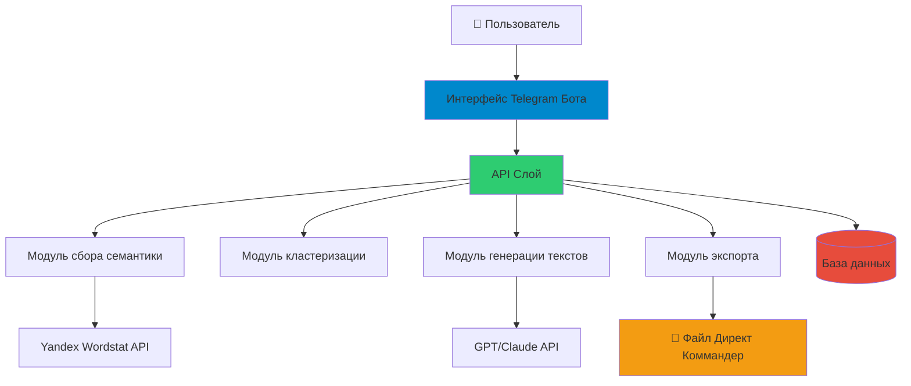
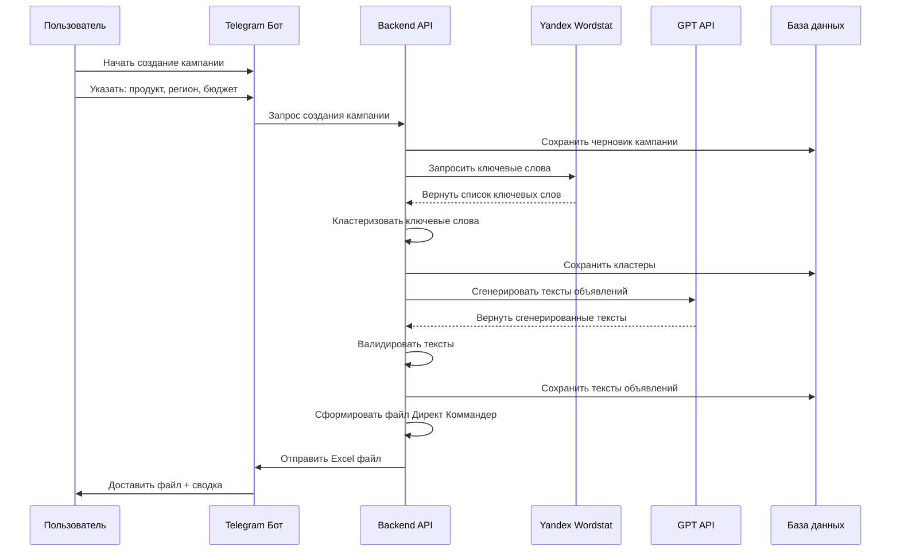

# Direct Helper - Сервис автоматизации рекламных кампаний Яндекс Директ

## 📋 Комплексный промпт проекта

**Название проекта:** Direct Helper

**Цель:** Автоматизированный сервис для создания рекламных кампаний Яндекс Директ с полным циклом автоматизации: сбор семантики из Wordstat, кластеризация ключевых слов, генерация текстов объявлений согласно требованиям Яндекс Директ, формирование файла для импорта в Директ Коммандер.

**Целевой пользователь:** Индивидуальный рекламодатель/маркетолог, управляющий собственными рекламными кампаниями (1-10 кампаний в месяц)

**Основные требования:**
1. Собирать семантические ключевые слова из Yandex Wordstat API
2. Кластеризовать ключевые слова в тематические группы с помощью ML-алгоритмов
3. Генерировать тексты объявлений в соответствии с техническими требованиями Яндекс Директ
4. Создавать файл экспорта совместимый с форматом шаблона Директ Коммандер
5. Удобный интерфейс для настройки кампании и мониторинга
6. Поддержка различных типов кампаний (поиск, РСЯ)
7. Интеграция с GPT/LLM для качественной генерации текстов объявлений
8. Сохранение данных для истории кампаний и возможности повторного использования

**Технические ограничения:**
- Должен работать с Yandex Direct API v5
- Поддержка формата Excel/CSV Директ Коммандер
- Соблюдение текстовых требований Яндекс Директ (длина заголовков, описаний, ограничения по символам)
- Поддержка русскоязычной семантики и генерации текстов

---

## 🏗️ Архитектура системы

### Рекомендуемый подход: Telegram-бот + Python Backend

**Почему Telegram-бот?**
- ✅ Не требуется хостинг фронтенда
- ✅ Работает на мобильных устройствах и десктопе
- ✅ Быстрое взаимодействие и уведомления
- ✅ Простая аутентификация и управление пользователями
- ✅ Возможность отправки файлов (Excel/CSV) напрямую
- ✅ Простое развертывание и обслуживание для персонального использования
- ✅ Встроенная база данных истории чатов

**Альтернатива:** Простой веб-дашборд может быть добавлен позже для визуальной аналитики

### Компоненты системы



### Поток данных



---

## 🛠️ Стек технологий

### Backend
- **Python 3.10+** - Основной язык
  - `python-telegram-bot` - Фреймворк для Telegram бота
  - `yandex-direct` или кастомный клиент - Интеграция с Yandex API
  - `openai` / `anthropic` - Интеграция с LLM для генерации текстов
  - `scikit-learn` - Кластеризация ключевых слов
  - `pandas` - Обработка данных
  - `openpyxl` - Генерация Excel файлов
  - `fastapi` - REST API (опционально, для будущего веб-интерфейса)
  - `celery` + `redis` - Асинхронная обработка задач (для длительных операций)

### Хранение данных
- **SQLite** - Простая файловая база данных (достаточно для персонального использования)
- **Альтернатива:** PostgreSQL (если понадобится масштабирование)

### NLP & ML
- **scikit-learn** - K-means, DBSCAN для кластеризации
- **spaCy** или **natasha** - Обработка русского языка
- **sentence-transformers** - Семантическое сходство для улучшенной кластеризации

### Интеграция с LLM
- **OpenAI GPT-4** - Высококачественная генерация русских текстов
- **Альтернативы:** YandexGPT, GigaChat, Anthropic Claude

### Генерация файлов
- **openpyxl** или **xlsxwriter** - Создание Excel файлов
- **pandas** - Структурирование данных для формата Директ Коммандер

### Инфраструктура
- **Docker** - Контейнеризация
- **Systemd** или **PM2** - Управление процессами
- **Git** - Контроль версий

---

## 📦 Структура проекта

```
direct-helper/
├── bot/
│   ├── __init__.py
│   ├── handlers/
│   │   ├── __init__.py
│   │   ├── start.py
│   │   ├── campaign.py
│   │   ├── settings.py
│   │   └── export.py
│   ├── keyboards.py
│   ├── states.py
│   └── middleware.py
├── core/
│   ├── __init__.py
│   ├── semantic/
│   │   ├── __init__.py
│   │   ├── wordstat_client.py
│   │   └── keyword_expander.py
│   ├── clustering/
│   │   ├── __init__.py
│   │   ├── clusterer.py
│   │   └── analyzer.py
│   ├── generation/
│   │   ├── __init__.py
│   │   ├── text_generator.py
│   │   └── validators.py
│   └── export/
│       ├── __init__.py
│       ├── direct_commander.py
│       └── templates.py
├── api/
│   ├── __init__.py
│   ├── yandex.py
│   └── llm.py
├── models/
│   ├── __init__.py
│   ├── campaign.py
│   ├── keyword.py
│   └── ad.py
├── database/
│   ├── __init__.py
│   ├── connection.py
│   └── migrations/
├── utils/
│   ├── __init__.py
│   ├── logger.py
│   └── config.py
├── tests/
├── config/
│   ├── config.yaml
│   └── direct_requirements.yaml
├── data/
│   └── templates/
│       └── direct_commander_template.xlsx
├── main.py
├── requirements.txt
├── Dockerfile
├── docker-compose.yml
└── README.md
```

---

## 🎯 Фазы реализации

### Фаза 1: Настройка проекта и инфраструктура
- Инициализировать структуру проекта
- Настроить окружение разработки
- Создать схему базы данных
- Настроить скелет Telegram бота
- Настроить логирование и обработку ошибок

### Фаза 2: Интеграция с Yandex Wordstat
- Реализовать аутентификацию Yandex Direct API
- Создать клиент Wordstat API
- Реализовать логику сбора ключевых слов
- Добавить расширение ключевых слов (связанные запросы)
- Сохранить сырые ключевые слова в базу данных

### Фаза 3: Кластеризация ключевых слов
- Реализовать предобработку текста для русского языка
- Создать пайплайн векторизации
- Реализовать алгоритмы кластеризации (K-means, DBSCAN)
- Добавить именование/маркировку кластеров
- Создать метрики качества кластеров

### Фаза 4: Генерация текстов объявлений
- Определить текстовые требования Яндекс Директ
- Реализовать шаблоны промптов для LLM
- Создать пайплайн генерации текстов
- Добавить валидацию текстов на соответствие требованиям Директа
- Реализовать логику повторных попыток при ошибках генерации

### Фаза 5: Экспорт в Директ Коммандер
- Проанализировать формат файла Директ Коммандер
- Создать парсер шаблона Excel
- Реализовать логику маппинга данных
- Генерировать совместимые Excel файлы
- Добавить валидацию файла

### Фаза 6: Интерфейс Telegram бота
- Реализовать поток разговора
- Создать мастер создания кампании
- Добавить уведомления о прогрессе
- Реализовать доставку файлов
- Добавить историю и управление кампаниями

### Фаза 7: Тестирование и оптимизация
- Юнит-тесты для основных модулей
- Интеграционные тесты для API клиентов
- Нагрузочное тестирование алгоритмов кластеризации
- Приемочное тестирование пользователем
- Оптимизация производительности

### Фаза 8: Документация и развертывание
- Написать пользовательскую документацию
- Создать API документацию
- Настроить пайплайн развертывания
- Настроить мониторинг и оповещения
- Создать стратегию резервного копирования

---

## 📊 Детальная спецификация ключевых модулей

### 1. Модуль сбора семантики

**Входные данные:**
- Базовое ключевое слово (слова)
- Целевой регион
- Язык

**Процесс:**
- Запрос к Yandex Wordstat API
- Расширение ключевых слов с помощью связанных запросов
- Фильтрация по частоте/релевантности
- Удаление дубликатов и стоп-слов

**Выходные данные:**
- Список ключевых слов с данными о частоте
- Сохранение в базе данных со ссылкой на кампанию

**Используемый API:** Yandex Direct API v5 - сервис Reports

### 2. Модуль кластеризации

**Входные данные:**
- Список ключевых слов из сбора семантики

**Процесс:**
- Векторизация ключевых слов с использованием TF-IDF или эмбеддингов
- Применение алгоритма кластеризации
- Определение оптимального количества кластеров
- Назначение меток кластеров
- Расчет метрик качества кластеров

**Выходные данные:**
- Группы ключевых слов (кластеры)
- Названия/темы кластеров
- Статистика кластеров

**Алгоритмы:**
- K-means кластеризация
- DBSCAN для обнаружения выбросов
- Иерархическая кластеризация (опционально)

### 3. Модуль генерации текстов

**Входные данные:**
- Кластер ключевых слов
- Описание продукта/услуги
- Название бренда
- Уникальные торговые предложения

**Процесс:**
- Построить промпт для LLM с требованиями Яндекс Директ
- Сгенерировать несколько вариантов текстов объявлений
- Валидировать на соответствие лимитам по символам
- Проверить на запрещенный контент
- Ранжировать по качеству

**Выходные данные:**
- Заголовок объявления (до 35 символов)
- Текст 1 (до 81 символа)
- Текст 2 (опционально, до 81 символа)
- Отображаемый путь URL

**Правила валидации:**
- Заголовок: макс 35 символов, без специальных символов
- Описание: макс 81 символ на строку
- Без запрещенных слов (медицинские утверждения, превосходные степени без доказательств)
- Правильная грамматика и пунктуация

### 4. Модуль экспорта

**Входные данные:**
- Структура кампании со всеми данными

**Процесс:**
- Загрузить шаблон Директ Коммандер
- Сопоставить данные со столбцами шаблона
- Сгенерировать иерархию кампании
- Форматировать данные согласно требованиям
- Создать Excel файл

**Выходные данные:**
- Файл `.xlsx` готовый для импорта в Директ Коммандер

**Структура файла:**
```
Название кампании | Название группы | Ключевое слово | Заголовок | Текст 1 | Текст 2 | Отображаемый URL | ...
```

---

## 🔌 Требования к интеграции с API

### Yandex Direct API v5

**Необходимые учетные данные:**
- OAuth токен
- Учетные данные приложения (Client ID, Client Secret)

**Используемые эндпоинты:**
1. **Сервис отчетов Wordstat**
   - Метод: `CreateNewWordstatReport`
   - Метод: `GetWordstatReport`

2. **Сервис ключевых слов** (опционально)
   - Метод: `get` - получение существующих ключевых слов

**Лимиты запросов:**
- 10 запросов в секунду
- 100,000 единиц в день

**Документация:** https://yandex.ru/dev/direct/doc/dg/concepts/about.html

### OpenAI GPT API

**Рекомендуемая модель:** GPT-4 или GPT-4-turbo

**Конфигурация:**
- Temperature: 0.7 (креативно, но контролируемо)
- Max tokens: 150 на объявление
- Системный промпт с требованиями Яндекс Директ

**Оценка стоимости:**
- ~$0.03 за кампанию (30-50 объявлений)

### Альтернативные варианты LLM
- YandexGPT (лучшая поддержка русского языка)
- Anthropic Claude 3 (хорошее следование инструкциям)
- Open-source: Saiga, ruGPT-3

---

## 💾 Схема базы данных

### Таблицы

**campaigns (кампании)**
```sql
id: INTEGER PRIMARY KEY
name: VARCHAR(255)
user_id: INTEGER
product_description: TEXT
target_region: VARCHAR(100)
budget: DECIMAL(10,2)
status: VARCHAR(50)
created_at: TIMESTAMP
updated_at: TIMESTAMP
```

**keywords (ключевые слова)**
```sql
id: INTEGER PRIMARY KEY
campaign_id: INTEGER (FK)
keyword: VARCHAR(255)
frequency: INTEGER
cluster_id: INTEGER
created_at: TIMESTAMP
```

**clusters (кластеры)**
```sql
id: INTEGER PRIMARY KEY
campaign_id: INTEGER (FK)
name: VARCHAR(255)
size: INTEGER
quality_score: FLOAT
created_at: TIMESTAMP
```

**ads (объявления)**
```sql
id: INTEGER PRIMARY KEY
cluster_id: INTEGER (FK)
title: VARCHAR(35)
text_1: VARCHAR(81)
text_2: VARCHAR(81)
display_url: VARCHAR(255)
status: VARCHAR(50)
created_at: TIMESTAMP
```

**users (пользователи)**
```sql
id: INTEGER PRIMARY KEY
telegram_id: INTEGER UNIQUE
username: VARCHAR(255)
yandex_token: TEXT (encrypted)
created_at: TIMESTAMP
```

---

## 🚀 Стратегия развертывания

### Окружение разработки
```bash
# Локальная разработка
python -m venv venv
source venv/bin/activate
pip install -r requirements.txt
cp config/config.example.yaml config/config.yaml
# Отредактировать config с вашими токенами
python main.py
```

### Варианты продакшн развертывания

**Вариант 1: VPS (Рекомендуется для персонального использования)**
- Ubuntu 22.04 LTS
- 2GB RAM, 1 CPU (достаточно)
- ~$5-10/месяц
- Сервисы: DigitalOcean, Hetzner, Timeweb

**Вариант 2: Docker контейнер**
```bash
docker-compose up -d
```

**Вариант 3: Serverless (если понадобится позже)**
- AWS Lambda + API Gateway
- Или Yandex Cloud Functions

### Мониторинг
- Sentry для отслеживания ошибок
- Простое логирование в файлы
- Telegram уведомления для администратора

---

## 📈 Будущие улучшения

### Фаза 9+ (Опционально)
1. **Веб-дашборд**
   - Визуальный конструктор кампаний
   - Аналитика и отчетность
   - Графики частоты ключевых слов
   
2. **Продвинутые функции**
   - A/B тестирование вариантов объявлений
   - Предложения по оптимизации ставок
   - Анализ конкурентов
   - Автоматизированные минус-слова
   - Интеграция с Яндекс Метрикой

3. **Поддержка нескольких пользователей**
   - Аутентификация пользователей
   - Совместное использование кампаний
   - Командная работа

4. **Продвинутый ML**
   - Прогнозирование эффективности ключевых слов
   - Автоматическое распределение бюджета
   - Обнаружение аномалий в кампаниях

---

## 🎨 Пользовательский поток Telegram бота

### Главное меню
```
🏠 Главное меню
├── 📝 Создать новую кампанию
├── 📋 Мои кампании
├── ⚙️ Настройки
└── ℹ️ Справка
```

### Поток создания кампании
```
Шаг 1: Название кампании
Шаг 2: Описание продукта/услуги
Шаг 3: Базовые ключевые слова (через запятую)
Шаг 4: Целевой регион
Шаг 5: Бюджет (опционально)
Шаг 6: Проверка и подтверждение

→ Обработка...
→ Сбор ключевых слов (1/4)
→ Кластеризация ключевых слов (2/4)
→ Генерация текстов объявлений (3/4)
→ Создание файла экспорта (4/4)

✅ Готово! Вот ваш файл Директ Коммандер
📊 Статистика:
- Ключевых слов: 157
- Кластеров: 12
- Создано объявлений: 36
```

---

## ⚠️ Критические соображения

### 1. Требования к текстам Яндекс Директ
- **Заголовок:** макс 35 символов, без восклицательных знаков (кроме товарных знаков)
- **Описание:** макс 81 символ на строку
- **Запрещено:** Медицинские утверждения, превосходные степени без доказательств, "лучший", "дешевле всех" без контекста
- **Обязательно:** Четкое предложение, релевантные ключевые слова, правильная грамматика

### 2. Лимиты API
- Реализовать экспоненциальную задержку
- Система очередей для массовых операций
- Кэширование частых запросов

### 3. Управление затратами
- Затраты на LLM API могут накапливаться
- Рассмотреть пакетные запросы
- Реализовать локальное кэширование
- Мониторить использование API

### 4. Безопасность данных
- Шифровать API токены
- Защитить учетные данные базы данных
- HTTPS для всех внешних запросов
- Регулярные резервные копии

### 5. Обработка ошибок
- Плавная деградация
- Понятные пользователю сообщения об ошибках
- Логика повторных попыток с лимитами
- Механизмы отката

---

## 📝 Пример конфигурации

```yaml
# config/config.yaml
telegram:
  bot_token: "ВАШ_ТОКЕН_БОТА"
  admin_id: 123456789

yandex:
  client_id: "ВАШ_CLIENT_ID"
  client_secret: "ВАШ_CLIENT_SECRET"
  oauth_token: "ВАШ_OAUTH_ТОКЕН"

openai:
  api_key: "ВАШ_КЛЮЧ_OPENAI"
  model: "gpt-4-turbo"
  temperature: 0.7

database:
  type: "sqlite"
  path: "data/direct_helper.db"

clustering:
  algorithm: "kmeans"
  max_clusters: 20
  min_cluster_size: 3

generation:
  ads_per_cluster: 3
  max_retries: 3
```

---

## 🎓 Чек-лист необходимых учетных данных API

- [ ] Токен Telegram бота (от @BotFather)
- [ ] Учетные данные Yandex Direct API
  - [ ] Зарегистрировать приложение на https://oauth.yandex.ru/
  - [ ] Получить OAuth токен с правами `direct:api`
- [ ] API ключ OpenAI (или альтернативного LLM)
- [ ] Опционально: Sentry DSN для отслеживания ошибок

---

## 📚 Справочные материалы

- [Документация Yandex Direct API](https://yandex.ru/dev/direct/doc/dg/concepts/about.html)
- [Формат Директ Коммандер](https://yandex.ru/support/direct/campaigns/excel.html)
- [Telegram Bot API](https://core.telegram.org/bots/api)
- [Требования к текстам Яндекс Директ](https://yandex.ru/support/direct/requirements/)

---

## Итоговая сводка

**Рекомендуемый стек:**
- **Интерфейс:** Telegram Бот
- **Backend:** Python 3.10+
- **База данных:** SQLite
- **API:** Yandex Direct API v5, OpenAI GPT-4
- **Развертывание:** VPS с Docker

**Ожидаемые эксплуатационные расходы:**
- VPS: $5-10/месяц
- OpenAI API: ~$0.03 за кампанию
- Итого: ~$10-15/месяц для 10 кампаний

**Следующие шаги:**
1. Зарегистрировать доступ к Yandex Direct API
2. Создать Telegram бота
3. Настроить окружение разработки
4. Начать с реализации Фазы 1
