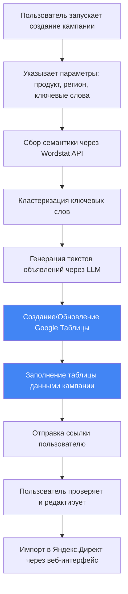

# 📊 Интеграция Google Sheets для Direct Helper

## Обзор задачи

**Цель:** Автоматически заполнять Google Таблицу по шаблону Яндекс Директа готовыми данными кампании (ключевые слова, группы объявлений, тексты), чтобы затем импортировать кампанию в Яндекс.Директ.

**Преимущества использования Google Sheets:**
- ✅ Удобный просмотр и редактирование данных перед импортом
- ✅ Совместный доступ для команды/клиентов
- ✅ Автоматическое сохранение и версионность
- ✅ Возможность ручной корректировки
- ✅ Интеграция с другими Google сервисами
- ✅ Доступ с любого устройства через браузер

---

## 🎯 Сценарий использования



---

## 📋 Формат шаблона Яндекс.Директ

### Структура таблицы для импорта

Яндекс.Директ принимает Excel файлы или Google Sheets с определенной структурой. Основные столбцы:

| Столбец | Описание | Обязательный | Пример |
|---------|----------|--------------|--------|
| **Campaign** | Название кампании | ✅ | "Продажа ноутбуков - Москва" |
| **AdGroup** | Название группы объявлений | ✅ | "Игровые ноутбуки" |
| **Keyword** | Ключевое слово | ✅ | "купить игровой ноутбук" |
| **MatchType** | Тип соответствия | ❌ | "Phrase" / "Exact" / "Broad" |
| **Bid** | Ставка (руб.) | ❌ | "50" |
| **AdTitle** | Заголовок объявления | ✅ | "Игровые ноутбуки - купить в Москве" |
| **AdText** | Текст объявления 1 | ✅ | "Широкий выбор игровых ноутбуков. Доставка по Москве. Гарантия 2 года." |
| **AdText2** | Текст объявления 2 | ❌ | "Консультация специалиста. Рассрочка 0%." |
| **URL** | Целевая страница | ✅ | "https://example.com/gaming-laptops" |
| **DisplayURL** | Отображаемая ссылка | ❌ | "example.com/акция" |
| **NegativeKeywords** | Минус-слова | ❌ | "-бесплатно -даром" |
| **Status** | Статус | ❌ | "Active" / "Paused" |

### Пример заполненной таблицы

```
Campaign                    | AdGroup              | Keyword                    | MatchType | AdTitle                              | AdText                                                      | URL
---------------------------|----------------------|----------------------------|-----------|--------------------------------------|-------------------------------------------------------------|---------------------------
Продажа ноутбуков - Москва | Игровые ноутбуки     | купить игровой ноутбук    | Phrase    | Игровые ноутбуки - купить в Москве  | Широкий выбор игровых ноутбуков. Доставка по Москве...    | https://example.com/gaming
Продажа ноутбуков - Москва | Игровые ноутбуки     | игровой ноутбук цена      | Phrase    | Игровые ноутбуки - купить в Москве  | Широкий выбор игровых ноутбуков. Доставка по Москве...    | https://example.com/gaming
Продажа ноутбуков - Москва | Ноутбуки для работы  | купить ноутбук для работы | Phrase    | Ноутбуки для работы - низкие цены   | Производительные ноутбуки для офиса и удаленной работы...  | https://example.com/office
```

---

## 🔌 Google Sheets API - Настройка и использование

### 1. Регистрация проекта в Google Cloud Console

**Шаг 1: Создание проекта**

1. Перейдите на https://console.cloud.google.com/
2. Нажмите "Создать проект" или выберите существующий
3. Введите название: "Direct Helper"
4. Нажмите "Создать"

**Шаг 2: Включение Google Sheets API**

1. В меню слева выберите "APIs & Services" → "Library"
2. Найдите "Google Sheets API"
3. Нажмите "Enable" (Включить)
4. Также включите "Google Drive API" (для создания файлов)

**Шаг 3: Создание Service Account (рекомендуется)**

Service Account - это специальный тип учетной записи для серверных приложений.

1. Перейдите в "APIs & Services" → "Credentials"
2. Нажмите "Create Credentials" → "Service Account"
3. Заполните:
   - **Name:** direct-helper-bot
   - **Description:** Service account for Direct Helper automation
4. Нажмите "Create and Continue"
5. Роль: "Editor" (или можно оставить без роли)
6. Нажмите "Done"

**Шаг 4: Создание ключа JSON**

1. Найдите созданный Service Account в списке
2. Нажмите на email сервисного аккаунта
3. Перейдите на вкладку "Keys"
4. Нажмите "Add Key" → "Create new key"
5. Выберите формат "JSON"
6. Нажмите "Create" - файл `credentials.json` скачается автоматически

**⚠️ ВАЖНО:** Сохраните этот файл в безопасном месте! Он дает полный доступ к вашим Google Sheets.

```bash
# Рекомендуемое расположение файла в проекте
config/google_credentials.json
```

Добавьте в `.gitignore`:
```
config/google_credentials.json
config/*.json
```

### 2. Альтернатива: OAuth 2.0 для пользовательского доступа

Если нужен доступ к личным таблицам пользователя (не рекомендуется для бота):

1. Создайте "OAuth 2.0 Client ID"
2. Тип приложения: "Desktop app" или "Web application"
3. Скачайте `client_secret.json`
4. Используйте flow авторизации через браузер

**Для Service Account проще и безопаснее!**

---

## 📦 Установка библиотек

### Python библиотеки для работы с Google Sheets

```bash
pip install google-auth google-auth-oauthlib google-auth-httplib2 google-api-python-client
pip install gspread  # Более удобная обертка над Google Sheets API
```

### Обновленный requirements.txt

```txt
# Существующие зависимости
python-telegram-bot==20.7
openai==1.6.1
pandas==2.1.4
openpyxl==3.1.2
scikit-learn==1.3.2
requests==2.31.0

# Google Sheets интеграция
google-auth==2.25.2
google-auth-oauthlib==1.2.0
google-auth-httplib2==0.2.0
google-api-python-client==2.110.0
gspread==5.12.3

# Дополнительные утилиты
python-dotenv==1.0.0  # Для управления переменными окружения
```

---

## 💻 Реализация интеграции

### Архитектура модуля Google Sheets

```
core/
└── export/
    ├── __init__.py
    ├── google_sheets_client.py    # Клиент для работы с Google Sheets API
    ├── sheet_formatter.py         # Форматирование данных для таблицы
    └── direct_template.py         # Шаблон структуры для Яндекс.Директ
```

### 1. Базовый клиент Google Sheets

```python
# core/export/google_sheets_client.py
import gspread
from google.oauth2.service_account import Credentials
from typing import List, Dict, Optional
import logging

logger = logging.getLogger(__name__)

class GoogleSheetsClient:
    """Клиент для работы с Google Sheets API"""
    
    # Необходимые права доступа
    SCOPES = [
        'https://www.googleapis.com/auth/spreadsheets',  # Чтение/запись таблиц
        'https://www.googleapis.com/auth/drive.file'     # Создание файлов
    ]
    
    def __init__(self, credentials_path: str):
        """
        Инициализация клиента
        
        Args:
            credentials_path: Путь к JSON файлу с учетными данными Service Account
        """
        try:
            # Аутентификация через Service Account
            credentials = Credentials.from_service_account_file(
                credentials_path,
                scopes=self.SCOPES
            )
            self.client = gspread.authorize(credentials)
            self.service_account_email = credentials.service_account_email
            logger.info(f"✅ Google Sheets клиент инициализирован: {self.service_account_email}")
            
        except Exception as e:
            logger.error(f"❌ Ошибка инициализации Google Sheets клиента: {e}")
            raise
    
    def create_spreadsheet(self, title: str, share_with_email: Optional[str] = None) -> Dict:
        """
        Создать новую таблицу
        
        Args:
            title: Название таблицы
            share_with_email: Email для предоставления доступа (опционально)
        
        Returns:
            Словарь с данными о таблице (id, url, title)
        """
        try:
            # Создаем новую таблицу
            spreadsheet = self.client.create(title)
            
            spreadsheet_id = spreadsheet.id
            spreadsheet_url = f"https://docs.google.com/spreadsheets/d/{spreadsheet_id}"
            
            logger.info(f"✅ Таблица создана: {title}")
            logger.info(f"📊 URL: {spreadsheet_url}")
            
            # Предоставляем доступ пользователю если указан email
            if share_with_email:
                self.share_spreadsheet(spreadsheet_id, share_with_email, role='writer')
            
            return {
                'id': spreadsheet_id,
                'url': spreadsheet_url,
                'title': title
            }
            
        except Exception as e:
            logger.error(f"❌ Ошибка создания таблицы: {e}")
            raise
    
    def share_spreadsheet(self, spreadsheet_id: str, email: str, role: str = 'writer'):
        """
        Предоставить доступ к таблице
        
        Args:
            spreadsheet_id: ID таблицы
            email: Email пользователя
            role: Роль доступа ('reader', 'writer', 'owner')
        """
        try:
            spreadsheet = self.client.open_by_key(spreadsheet_id)
            spreadsheet.share(email, perm_type='user', role=role, notify=True)
            logger.info(f"✅ Доступ предоставлен: {email} ({role})")
        except Exception as e:
            logger.error(f"❌ Ошибка предоставления доступа: {e}")
            # Не бросаем исключение - доступ не критичен
    
    def get_spreadsheet(self, spreadsheet_id: str):
        """Получить объект таблицы по ID"""
        try:
            return self.client.open_by_key(spreadsheet_id)
        except Exception as e:
            logger.error(f"❌ Ошибка получения таблицы {spreadsheet_id}: {e}")
            raise
    
    def write_data(
        self, 
        spreadsheet_id: str, 
        data: List[List], 
        sheet_name: str = 'Sheet1',
        start_cell: str = 'A1'
    ):
        """
        Записать данные в таблицу
        
        Args:
            spreadsheet_id: ID таблицы
            data: Данные в виде списка списков (строки и столбцы)
            sheet_name: Название листа
            start_cell: Начальная ячейка (например, 'A1')
        """
        try:
            spreadsheet = self.get_spreadsheet(spreadsheet_id)
            
            # Получаем или создаем лист
            try:
                worksheet = spreadsheet.worksheet(sheet_name)
            except gspread.exceptions.WorksheetNotFound:
                worksheet = spreadsheet.add_worksheet(title=sheet_name, rows=len(data)+10, cols=20)
            
            # Записываем данные
            worksheet.update(start_cell, data)
            logger.info(f"✅ Данные записаны в {sheet_name}: {len(data)} строк")
            
        except Exception as e:
            logger.error(f"❌ Ошибка записи данных: {e}")
            raise
    
    def format_header(self, spreadsheet_id: str, sheet_name: str = 'Sheet1'):
        """
        Форматировать заголовок таблицы (жирный шрифт, цвет фона)
        
        Args:
            spreadsheet_id: ID таблицы
            sheet_name: Название листа
        """
        try:
            spreadsheet = self.get_spreadsheet(spreadsheet_id)
            worksheet = spreadsheet.worksheet(sheet_name)
            
            # Форматируем первую строку (заголовок)
            worksheet.format('1', {
                'backgroundColor': {'red': 0.2, 'green': 0.6, 'blue': 0.86},  # Синий цвет
                'textFormat': {
                    'bold': True,
                    'fontSize': 11,
                    'foregroundColor': {'red': 1.0, 'green': 1.0, 'blue': 1.0}  # Белый текст
                },
                'horizontalAlignment': 'CENTER'
            })
            
            # Замораживаем первую строку
            worksheet.freeze(rows=1)
            
            logger.info(f"✅ Заголовок отформатирован в {sheet_name}")
            
        except Exception as e:
            logger.error(f"❌ Ошибка форматирования заголовка: {e}")
            # Не критично - продолжаем работу
    
    def auto_resize_columns(self, spreadsheet_id: str, sheet_name: str = 'Sheet1'):
        """
        Автоматически подогнать ширину столбцов под содержимое
        
        Args:
            spreadsheet_id: ID таблицы
            sheet_name: Название листа
        """
        try:
            spreadsheet = self.get_spreadsheet(spreadsheet_id)
            worksheet = spreadsheet.worksheet(sheet_name)
            
            # Получаем ID листа
            sheet_id = worksheet._properties['sheetId']
            
            # Формируем запрос для авто-подгонки ширины
            requests = [{
                'autoResizeDimensions': {
                    'dimensions': {
                        'sheetId': sheet_id,
                        'dimension': 'COLUMNS',
                        'startIndex': 0,
                        'endIndex': 15  # Первые 15 столбцов
                    }
                }
            }]
            
            spreadsheet.batch_update({'requests': requests})
            logger.info(f"✅ Ширина столбцов подогнана в {sheet_name}")
            
        except Exception as e:
            logger.error(f"❌ Ошибка подгонки столбцов: {e}")
            # Не критично
```

### 2. Форматирование данных кампании

```python
# core/export/sheet_formatter.py
from typing import List, Dict
from dataclasses import dataclass
import logging

logger = logging.getLogger(__name__)

@dataclass
class CampaignData:
    """Структура данных кампании"""
    campaign_name: str
    ad_groups: List[Dict]  # Список групп объявлений
    target_url: str
    
@dataclass
class AdGroup:
    """Группа объявлений"""
    name: str
    keywords: List[str]
    ads: List[Dict]  # Список объявлений

class DirectSheetFormatter:
    """Форматирование данных для шаблона Яндекс.Директ"""
    
    # Заголовки столбцов по стандарту Яндекс.Директ
    HEADERS = [
        'Campaign',           # Название кампании
        'AdGroup',           # Группа объявлений
        'Keyword',           # Ключевое слово
        'MatchType',         # Тип соответствия
        'Bid',               # Ставка
        'AdTitle',           # Заголовок объявления
        'AdText',            # Текст объявления 1
        'AdText2',           # Текст объявления 2
        'URL',               # Целевая страница
        'DisplayURL',        # Отображаемая ссылка
        'NegativeKeywords',  # Минус-слова
        'Status'             # Статус
    ]
    
    def __init__(self):
        self.default_match_type = 'Phrase'  # По умолчанию фразовое соответствие
        self.default_status = 'Active'
        self.default_bid = ''  # Пустая ставка - будет автоматическая
    
    def format_campaign_data(self, campaign_data: Dict) -> List[List]:
        """
        Преобразовать данные кампании в формат таблицы
        
        Args:
            campaign_data: Словарь с данными кампании
            
        Returns:
            Список списков (строки таблицы), первая строка - заголовки
        """
        try:
            # Начинаем с заголовков
            table_data = [self.HEADERS]
            
            campaign_name = campaign_data.get('campaign_name', 'New Campaign')
            target_url = campaign_data.get('target_url', '')
            ad_groups = campaign_data.get('ad_groups', [])
            
            logger.info(f"📊 Форматирование кампании: {campaign_name}")
            logger.info(f"📁 Групп объявлений: {len(ad_groups)}")
            
            # Обрабатываем каждую группу объявлений
            for ad_group in ad_groups:
                group_name = ad_group.get('name', 'Unnamed Group')
                keywords = ad_group.get('keywords', [])
                ads = ad_group.get('ads', [])
                negative_keywords = ad_group.get('negative_keywords', [])
                
                # Формируем строку минус-слов
                negative_kw_str = ' '.join([f"-{kw}" for kw in negative_keywords]) if negative_keywords else ''
                
                logger.info(f"  📌 Группа: {group_name} | Ключевых слов: {len(keywords)} | Объявлений: {len(ads)}")
                
                # Если нет объявлений - создаем пустую строку для каждого ключевого слова
                if not ads:
                    for keyword in keywords:
                        row = self._create_row(
                            campaign_name=campaign_name,
                            ad_group_name=group_name,
                            keyword=keyword,
                            ad_title='',
                            ad_text='',
                            ad_text2='',
                            url=target_url,
                            negative_keywords=negative_kw_str
                        )
                        table_data.append(row)
                else:
                    # Для каждого объявления создаем строки для всех ключевых слов
                    for ad in ads:
                        ad_title = ad.get('title', '')
                        ad_text = ad.get('text', '')
                        ad_text2 = ad.get('text2', '')
                        
                        for keyword in keywords:
                            row = self._create_row(
                                campaign_name=campaign_name,
                                ad_group_name=group_name,
                                keyword=keyword,
                                ad_title=ad_title,
                                ad_text=ad_text,
                                ad_text2=ad_text2,
                                url=target_url,
                                negative_keywords=negative_kw_str
                            )
                            table_data.append(row)
            
            total_rows = len(table_data) - 1  # Без учета заголовка
            logger.info(f"✅ Сформировано строк: {total_rows}")
            
            return table_data
            
        except Exception as e:
            logger.error(f"❌ Ошибка форматирования данных кампании: {e}")
            raise
    
    def _create_row(
        self,
        campaign_name: str,
        ad_group_name: str,
        keyword: str,
        ad_title: str,
        ad_text: str,
        ad_text2: str,
        url: str,
        negative_keywords: str = ''
    ) -> List[str]:
        """Создать строку таблицы"""
        return [
            campaign_name,           # Campaign
            ad_group_name,          # AdGroup
            keyword,                # Keyword
            self.default_match_type, # MatchType
            self.default_bid,       # Bid
            ad_title,               # AdTitle
            ad_text,                # AdText
            ad_text2,               # AdText2
            url,                    # URL
            '',                     # DisplayURL (пусто)
            negative_keywords,      # NegativeKeywords
            self.default_status     # Status
        ]
    
    def validate_row_data(self, row: List[str]) -> Dict[str, List[str]]:
        """
        Валидация строки данных на соответствие требованиям Яндекс.Директ
        
        Returns:
            Словарь с ошибками (пустой если все ок)
        """
        errors = {}
        
        if len(row) < len(self.HEADERS):
            errors['structure'] = ['Недостаточно столбцов в строке']
            return errors
        
        # Проверка обязательных полей
        campaign = row[0]
        ad_group = row[1]
        keyword = row[2]
        ad_title = row[5]
        ad_text = row[6]
        url = row[8]
        
        if not campaign:
            errors.setdefault('campaign', []).append('Не указано название кампании')
        
        if not ad_group:
            errors.setdefault('ad_group', []).append('Не указана группа объявлений')
        
        if not keyword:
            errors.setdefault('keyword', []).append('Не указано ключевое слово')
        
        # Проверка длины заголовка (макс 35 символов)
        if ad_title and len(ad_title) > 35:
            errors.setdefault('ad_title', []).append(
                f'Заголовок слишком длинный: {len(ad_title)} символов (макс 35)'
            )
        
        # Проверка длины текста (макс 81 символ)
        if ad_text and len(ad_text) > 81:
            errors.setdefault('ad_text', []).append(
                f'Текст объявления слишком длинный: {len(ad_text)} символов (макс 81)'
            )
        
        return errors
```

### 3. Главный экспортер

```python
# core/export/google_sheets_exporter.py
from typing import Dict, Optional
import logging
from .google_sheets_client import GoogleSheetsClient
from .sheet_formatter import DirectSheetFormatter

logger = logging.getLogger(__name__)

class GoogleSheetsExporter:
    """Главный класс для экспорта кампаний в Google Sheets"""
    
    def __init__(self, credentials_path: str):
        """
        Args:
            credentials_path: Путь к JSON файлу с учетными данными
        """
        self.client = GoogleSheetsClient(credentials_path)
        self.formatter = DirectSheetFormatter()
    
    def export_campaign(
        self, 
        campaign_data: Dict,
        spreadsheet_title: Optional[str] = None,
        user_email: Optional[str] = None
    ) -> Dict:
        """
        Экспортировать кампанию в Google Sheets
        
        Args:
            campaign_data: Данные кампании
            spreadsheet_title: Название таблицы (опционально)
            user_email: Email пользователя для предоставления доступа
        
        Returns:
            Словарь с информацией о созданной таблице
        """
        try:
            # Формируем название таблицы
            if not spreadsheet_title:
                campaign_name = campaign_data.get('campaign_name', 'Campaign')
                spreadsheet_title = f"Direct Helper - {campaign_name}"
            
            logger.info(f"🚀 Начало экспорта кампании: {spreadsheet_title}")
            
            # Создаем таблицу
            spreadsheet_info = self.client.create_spreadsheet(
                title=spreadsheet_title,
                share_with_email=user_email
            )
            
            spreadsheet_id = spreadsheet_info['id']
            
            # Форматируем данные кампании
            table_data = self.formatter.format_campaign_data(campaign_data)
            
            # Записываем данные
            self.client.write_data(
                spreadsheet_id=spreadsheet_id,
                data=table_data,
                sheet_name='Campaign Data',
                start_cell='A1'
            )
            
            # Форматируем заголовок
            self.client.format_header(spreadsheet_id, 'Campaign Data')
            
            # Подгоняем ширину столбцов
            self.client.auto_resize_columns(spreadsheet_id, 'Campaign Data')
            
            # Добавляем инструкции на отдельном листе
            self._add_instructions(spreadsheet_id)
            
            logger.info(f"✅ Экспорт завершен: {spreadsheet_info['url']}")
            
            return spreadsheet_info
            
        except Exception as e:
            logger.error(f"❌ Ошибка экспорта кампании: {e}")
            raise
    
    def _add_instructions(self, spreadsheet_id: str):
        """Добавить лист с инструкциями"""
        try:
            instructions_data = [
                ['📋 Инструкция по использованию'],
                [''],
                ['1. Проверьте данные на листе "Campaign Data"'],
                ['2. При необходимости отредактируйте тексты объявлений и ключевые слова'],
                ['3. Проверьте соответствие требованиям Яндекс.Директ:'],
                ['   • Заголовок: максимум 35 символов'],
                ['   • Текст объявления: максимум 81 символ'],
                ['   • URL должен быть рабочим'],
                [''],
                ['4. Импорт в Яндекс.Директ:'],
                ['   • Перейдите в интерфейс Яндекс.Директ'],
                ['   • Выберите "Создать кампанию" → "Импорт"'],
                ['   • Укажите ссылку на эту Google Таблицу'],
                ['   • Или скачайте в формате Excel и импортируйте'],
                [''],
                ['📞 Поддержка: https://t.me/direct_helper_bot'],
                [''],
                ['⚠️ Не удаляйте и не переименовывайте столбцы на листе "Campaign Data"!']
            ]
            
            self.client.write_data(
                spreadsheet_id=spreadsheet_id,
                data=instructions_data,
                sheet_name='Инструкция',
                start_cell='A1'
            )
            
            # Форматируем заголовок инструкции
            spreadsheet = self.client.get_spreadsheet(spreadsheet_id)
            worksheet = spreadsheet.worksheet('Инструкция')
            worksheet.format('A1', {
                'textFormat': {'bold': True, 'fontSize': 14},
                'backgroundColor': {'red': 0.95, 'green': 0.95, 'blue': 0.95}
            })
            
            logger.info("✅ Инструкции добавлены")
            
        except Exception as e:
            logger.error(f"❌ Ошибка добавления инструкций: {e}")
            # Не критично - продолжаем
```

### 4. Интеграция с Telegram ботом

```python
# bot/handlers/export.py
from telegram import Update
from telegram.ext import ContextTypes
from core.export.google_sheets_exporter import GoogleSheetsExporter
import logging

logger = logging.getLogger(__name__)

async def export_to_sheets(update: Update, context: ContextTypes.DEFAULT_TYPE):
    """Экспорт готовой кампании в Google Sheets"""
    
    user_id = update.effective_user.id
    
    # Получаем данные кампании из контекста
    campaign_data = context.user_data.get('campaign_data')
    
    if not campaign_data:
        await update.message.reply_text(
            "❌ Нет данных кампании для экспорта. Сначала создайте кампанию."
        )
        return
    
    # Спрашиваем email пользователя для предоставления доступа
    await update.message.reply_text(
        "📧 Укажите ваш email для предоставления доступа к таблице:\n\n"
        "Или отправьте /skip чтобы пропустить этот шаг."
    )
    
    # Переходим в состояние ожидания email
    return 'WAITING_EMAIL'

async def handle_email_input(update: Update, context: ContextTypes.DEFAULT_TYPE):
    """Обработка ввода email"""
    
    email = update.message.text.strip()
    
    # Проверяем формат email
    if '@' not in email or '.' not in email:
        await update.message.reply_text(
            "❌ Неверный формат email. Попробуйте еще раз или отправьте /skip"
        )
        return 'WAITING_EMAIL'
    
    context.user_data['user_email'] = email
    
    # Запускаем экспорт
    await perform_export(update, context)
    
    return 'CAMPAIGN_COMPLETED'

async def perform_export(update: Update, context: ContextTypes.DEFAULT_TYPE):
    """Выполнить экспорт в Google Sheets"""
    
    try:
        await update.message.reply_text(
            "⏳ Создаю Google Таблицу и заполняю данными...\n"
            "Это может занять несколько секунд."
        )
        
        # Получаем данные
        campaign_data = context.user_data.get('campaign_data')
        user_email = context.user_data.get('user_email')
        
        # Инициализируем экспортер
        credentials_path = 'config/google_credentials.json'
        exporter = GoogleSheetsExporter(credentials_path)
        
        # Экспортируем
        spreadsheet_info = exporter.export_campaign(
            campaign_data=campaign_data,
            user_email=user_email
        )
        
        # Формируем сообщение с результатом
        message = (
            f"✅ Google Таблица создана!\n\n"
            f"📊 **{spreadsheet_info['title']}**\n\n"
            f"🔗 Ссылка: {spreadsheet_info['url']}\n\n"
            f"📋 Что дальше:\n"
            f"1. Откройте таблицу по ссылке выше\n"
            f"2. Проверьте и отредактируйте данные при необходимости\n"
            f"3. Импортируйте в Яндекс.Директ:\n"
            f"   • Перейдите в интерфейс Директа\n"
            f"   • Выберите 'Создать кампанию' → 'Импорт'\n"
            f"   • Укажите ссылку на Google Таблицу\n\n"
        )
        
        if user_email:
            message += f"✉️ Доступ предоставлен на email: {user_email}\n\n"
        
        message += "💡 Инструкции находятся на отдельном листе таблицы"
        
        await update.message.reply_text(message, parse_mode='Markdown')
        
        logger.info(f"✅ Пользователь {update.effective_user.id} успешно экспортировал кампанию")
        
    except Exception as e:
        logger.error(f"❌ Ошибка экспорта: {e}")
        await update.message.reply_text(
            f"❌ Произошла ошибка при создании таблицы:\n{str(e)}\n\n"
            f"Пожалуйста, попробуйте позже или обратитесь в поддержку."
        )
```

---

## 🔧 Настройка конфигурации

### Обновленный config.yaml

```yaml
# config/config.yaml

telegram:
  bot_token: "YOUR_BOT_TOKEN"
  admin_id: 123456789

yandex:
  client_id: "YOUR_CLIENT_ID"
  client_secret: "YOUR_CLIENT_SECRET"
  oauth_token: "YOUR_OAUTH_TOKEN"

openai:
  api_key: "YOUR_OPENAI_KEY"
  model: "gpt-4-turbo"
  temperature: 0.7

# Новая секция для Google Sheets
google_sheets:
  credentials_path: "config/google_credentials.json"
  default_share_permission: "writer"  # reader / writer / owner
  auto_share: true  # Автоматически предоставлять доступ

database:
  type: "sqlite"
  path: "data/direct_helper.db"

export:
  formats:
    - "google_sheets"  # Основной формат
    - "excel"          # Дополнительно Excel
  default_format: "google_sheets"
```

---

## 📊 Структура данных кампании

### Пример JSON структуры для кампании

```json
{
  "campaign_name": "Продажа ноутбуков - Москва",
  "target_url": "https://example.com/laptops",
  "budget": 50000,
  "region": "Москва",
  "ad_groups": [
    {
      "name": "Игровые ноутбуки",
      "keywords": [
        "купить игровой ноутбук",
        "игровой ноутбук цена",
        "ноутбук для игр москва"
      ],
      "negative_keywords": ["бесплатно", "даром", "б/у"],
      "ads": [
        {
          "title": "Игровые ноутбуки - купить в Москве",
          "text": "Широкий выбор игровых ноутбуков. Доставка по Москве за 1 день. Гарантия 2 года.",
          "text2": "Консультация специалиста. Рассрочка 0%. Официальная гарантия."
        }
      ]
    },
    {
      "name": "Ноутбуки для работы",
      "keywords": [
        "купить ноутбук для работы",
        "ноутбук для офиса",
        "рабочий ноутбук москва"
      ],
      "negative_keywords": ["игровой", "геймерский"],
      "ads": [
        {
          "title": "Ноутбуки для работы - низкие цены",
          "text": "Производительные ноутбуки для офиса и удаленной работы. Быстрая доставка.",
          "text2": "Большой выбор моделей. Помощь в выборе. Гарантия производителя."
        }
      ]
    }
  ]
}
```

---

## 🎯 План реализации

### Этап 1: Настройка Google Cloud и API ✅
- [x] Создать проект в Google Cloud Console
- [x] Включить Google Sheets API и Google Drive API
- [x] Создать Service Account
- [x] Скачать credentials.json
- [x] Сохранить в безопасном месте

### Этап 2: Установка зависимостей ✅
- [ ] Установить Python библиотеки: `gspread`, `google-auth`
- [ ] Обновить `requirements.txt`
- [ ] Протестировать аутентификацию

### Этап 3: Разработка модуля экспорта
- [ ] Реализовать `GoogleSheetsClient` (базовый клиент)
- [ ] Реализовать `DirectSheetFormatter` (форматирование данных)
- [ ] Реализовать `GoogleSheetsExporter` (главный экспортер)
- [ ] Добавить валидацию данных

### Этап 4: Интеграция с ботом
- [ ] Добавить команду экспорта в бот
- [ ] Реализовать запрос email пользователя
- [ ] Добавить обработку ошибок
- [ ] Создать сообщения с результатом

### Этап 5: Форматирование и UX
- [ ] Настроить форматирование заголовков
- [ ] Добавить автоподгонку ширины столбцов
- [ ] Создать лист с инструкциями
- [ ] Добавить примеры и подсказки

### Этап 6: Тестирование
- [ ] Протестировать создание таблиц
- [ ] Протестировать предоставление доступа
- [ ] Протестировать экспорт реальных кампаний
- [ ] Проверить импорт в Яндекс.Директ

### Этап 7: Документация
- [ ] Написать инструкцию для пользователей
- [ ] Создать видео-туториал
- [ ] Добавить FAQ

---

## 🔐 Безопасность

### Защита учетных данных

```python
# utils/security.py
import os
from pathlib import Path
from cryptography.fernet import Fernet

class CredentialsManager:
    """Менеджер для безопасного хранения учетных данных"""
    
    def __init__(self, encryption_key: str = None):
        if not encryption_key:
            encryption_key = os.getenv('ENCRYPTION_KEY')
        
        if not encryption_key:
            raise ValueError("Encryption key not provided")
        
        self.fernet = Fernet(encryption_key.encode())
    
    def encrypt_credentials(self, credentials_path: str) -> str:
        """Зашифровать файл credentials.json"""
        with open(credentials_path, 'rb') as f:
            data = f.read()
        
        encrypted = self.fernet.encrypt(data)
        
        encrypted_path = credentials_path + '.encrypted'
        with open(encrypted_path, 'wb') as f:
            f.write(encrypted)
        
        return encrypted_path
    
    def decrypt_credentials(self, encrypted_path: str) -> Dict:
        """Расшифровать учетные данные"""
        with open(encrypted_path, 'rb') as f:
            encrypted_data = f.read()
        
        decrypted = self.fernet.decrypt(encrypted_data)
        return json.loads(decrypted.decode())
```

### Best Practices

1. **Никогда не коммитьте credentials.json в git**
   ```gitignore
   config/google_credentials.json
   config/*.json
   *.encrypted
   ```

2. **Используйте переменные окружения**
   ```bash
   export GOOGLE_CREDENTIALS_PATH=/secure/path/credentials.json
   ```

3. **Ограничьте права Service Account**
   - Давайте только необходимые права
   - Используйте отдельные аккаунты для разных окружений

4. **Регулярно ротируйте ключи**
   - Создавайте новые ключи каждые 90 дней
   - Удаляйте старые неиспользуемые ключи

---

## 📈 Мониторинг и логирование

```python
# utils/sheets_monitor.py
import logging
from datetime import datetime

class SheetsActivityLogger:
    """Логирование активности работы с Google Sheets"""
    
    def __init__(self):
        self.logger = logging.getLogger('sheets_activity')
    
    def log_export(self, user_id: int, campaign_name: str, spreadsheet_url: str):
        """Логировать экспорт кампании"""
        self.logger.info(
            f"EXPORT | User: {user_id} | Campaign: {campaign_name} | "
            f"URL: {spreadsheet_url} | Time: {datetime.now()}"
        )
    
    def log_error(self, user_id: int, error: Exception):
        """Логировать ошибку"""
        self.logger.error(
            f"ERROR | User: {user_id} | Error: {str(error)} | "
            f"Type: {type(error).__name__} | Time: {datetime.now()}"
        )
```

---

## 🚀 Дополнительные возможности

### 1. Шаблоны кампаний

Создавайте повторно используемые шаблоны:

```python
def create_template_spreadsheet(template_name: str) -> str:
    """Создать шаблон таблицы с примерами"""
    # Создать таблицу с примером структуры
    # Сохранить ID шаблона
    # Пользователи смогут копировать шаблон
    pass
```

### 2. Массовый импорт

Импорт нескольких кампаний в одну таблицу:

```python
def export_multiple_campaigns(campaigns: List[Dict]) -> str:
    """Экспорт нескольких кампаний на отдельные листы"""
    # Создать одну таблицу
    # Каждая кампания на отдельном листе
    pass
```

### 3. Автообновление

Автоматическое обновление таблицы при изменении кампании:

```python
def update_existing_spreadsheet(spreadsheet_id: str, campaign_data: Dict):
    """Обновить существующую таблицу новыми данными"""
    # Найти строки кампании
    # Обновить измененные данные
    pass
```

---

## 📝 Инструкция для пользователя

### Как использовать Google Sheets экспорт

**Шаг 1: Создайте кампанию в боте**
1. Запустите бота: `/start`
2. Создайте новую кампанию: "Создать кампанию"
3. Заполните все данные: продукт, регион, ключевые слова

**Шаг 2: Экспортируйте в Google Sheets**
1. После генерации объявлений выберите "Экспорт в Google Sheets"
2. Укажите ваш email для получения доступа
3. Получите ссылку на таблицу

**Шаг 3: Проверьте и отредактируйте**
1. Откройте таблицу в Google Sheets
2. Проверьте все данные на корректность
3. При необходимости отредактируйте тексты объявлений

**Шаг 4: Импортируйте в Яндекс.Директ**
1. Войдите в интерфейс Яндекс.Директ
2. Выберите "Создать кампанию" → "Импорт"
3. Укажите ссылку на вашу Google Таблицу
4. Или скачайте таблицу в Excel и загрузите файл

---

## ⚠️ Troubleshooting

### Проблема: "Insufficient Permission"
**Решение:** Убедитесь что включены оба API:
- Google Sheets API
- Google Drive API

### Проблема: "File not found"
**Решение:** Проверьте путь к `credentials.json`:
```python
# Должен быть абсолютный путь или относительно рабочей директории
credentials_path = 'config/google_credentials.json'
```

### Проблема: "Access denied" при импорте в Директ
**Решение:** Сделайте таблицу доступной "по ссылке":
1. Откройте таблицу
2. Нажмите "Настроить доступ"
3. Выберите "Доступно всем, у кого есть ссылка"

---

## 📚 Справочные материалы

- [Google Sheets API Documentation](https://developers.google.com/sheets/api)
- [gspread Library Documentation](https://docs.gspread.org/)
- [Service Accounts Guide](https://cloud.google.com/iam/docs/service-accounts)
- [Яндекс.Директ: Импорт кампаний](https://yandex.ru/support/direct/campaigns/import.html)

---

## ✅ Чек-лист подготовки

- [ ] Создан проект в Google Cloud Console
- [ ] Включены Google Sheets API и Google Drive API
- [ ] Создан Service Account
- [ ] Скачан файл credentials.json
- [ ] Файл сохранен в `config/google_credentials.json`
- [ ] Добавлен в .gitignore
- [ ] Установлены Python библиотеки
- [ ] Протестирована аутентификация
- [ ] Реализованы все модули экспорта
- [ ] Добавлена интеграция с ботом
- [ ] Создана документация для пользователей

---

## 🎉 Итоговая сводка

**Что мы получаем:**

✅ **Автоматизация:** Готовые кампании автоматически экспортируются в Google Sheets
✅ **Удобство:** Пользователи могут просматривать и редактировать данные в браузере
✅ **Гибкость:** Поддержка любого количества кампаний и групп объявлений
✅ **Совместимость:** Прямой импорт в Яндекс.Директ из Google Sheets
✅ **Безопасность:** Service Account для безопасного доступа
✅ **Масштабируемость:** Легко обрабатывать большие кампании

**Следующие шаги:**
1. Настроить Google Cloud проект
2. Реализовать модули экспорта
3. Интегрировать с Telegram ботом
4. Протестировать с реальными данными
5. Создать инструкции для пользователей
