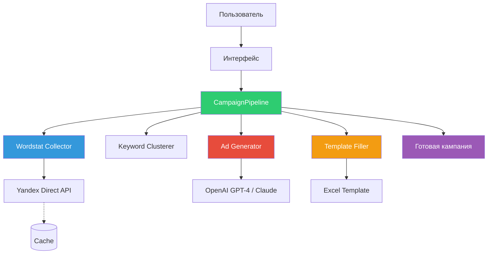
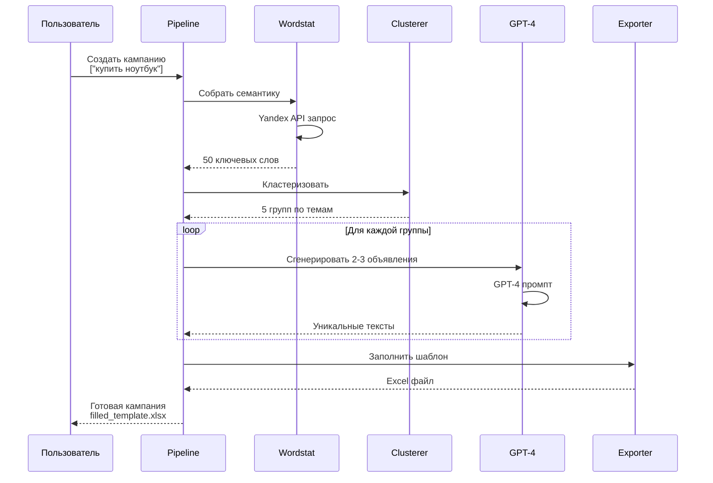
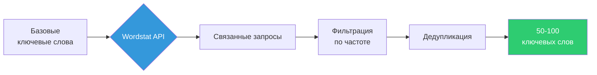
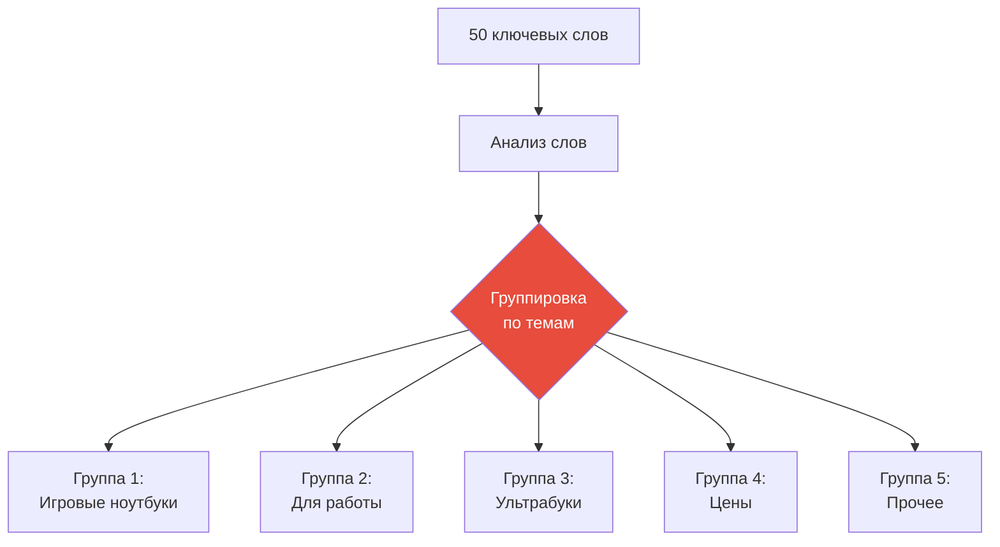
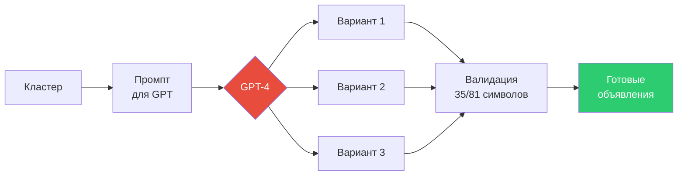
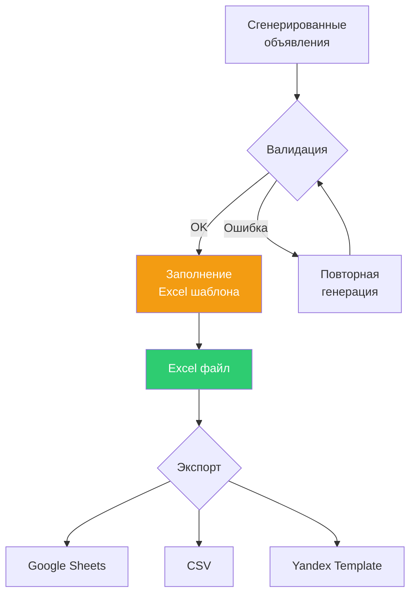

# 🏗️ Direct Helper - Архитектура сервиса с полной интеграцией API

## Обзор

Полная архитектура сервиса автоматизации создания рекламных кампаний Яндекс.Директ с интеграцией:
- **Yandex Wordstat API** - сбор семантики
- **GPT-4/Claude** - генерация текстов объявлений
- **Google Sheets API** - экспорт результатов

---

## 🎯 Концепция сервиса

### Что делает сервис:

```
Базовые ключевые слова (от пользователя)
    ↓
Yandex Wordstat API (расширение семантики)
    ↓
Кластеризация (группировка по темам)
    ↓
GPT-4/Claude (генерация уникальных текстов объявлений)
    ↓
Заполнение Yandex.Direct шаблона
    ↓
Готовая кампания для импорта
```

---

## 📊 Архитектурная диаграмма

### Компоненты системы



### Поток данных



---

## 🖥️ Пользовательский интерфейс

### Вариант 1: Консольный интерфейс (MVP)

```
┌─────────────────────────────────────────────────────────────┐
│  Direct Helper - Создание рекламной кампании                │
└─────────────────────────────────────────────────────────────┘

📝 Введите параметры кампании:

1. Название кампании: Интернет-магазин ноутбуков
2. Базовые ключевые слова: купить ноутбук, игровой ноутбук
3. Целевой URL: https://example.com/laptops
4. Регион: Москва
5. Бюджет: 50000 руб

───────────────────────────────────────────────────────────────

⏳ Создание кампании...

[████████░░] 80%  Генерация текстов объявлений (3/5)

───────────────────────────────────────────────────────────────

✅ Кампания создана!

📊 Результат:
   • Собрано ключевых слов: 47
   • Создано групп: 5
   • Сгенерировано объявлений: 12
   • Формат: Yandex.Direct Excel

📄 Файл: output/campaign_2024-02-05.xlsx

🔗 Действия:
   [1] Открыть файл
   [2] Загрузить в Google Sheets
   [3] Создать новую кампанию
   [Q] Выход
```

### Вариант 2: Telegram Bot (Future)

```
┌─────────────────────────────────────────┐
│  Direct Helper Bot                       │
│  ─────────────────────────────────────  │
│                                          │
│  🏠 Главное меню                         │
│                                          │
│  ┌────────────────────────────────────┐ │
│  │ 📝 Создать новую кампанию           │ │
│  └────────────────────────────────────┘ │
│                                          │
│  ┌────────────────────────────────────┐ │
│  │ 📋 Мои кампании (3)                 │ │
│  └────────────────────────────────────┘ │
│                                          │
│  ┌────────────────────────────────────┐ │
│  │ ⚙️  Настройки API                    │ │
│  └────────────────────────────────────┘ │
│                                          │
│  ┌────────────────────────────────────┐ │
│  │ ℹ️  Справка                          │ │
│  └────────────────────────────────────┘ │
└─────────────────────────────────────────┘

↓ Пользователь выбирает "Создать кампанию"

┌─────────────────────────────────────────┐
│  Шаг 1/5 - Название кампании             │
│  ─────────────────────────────────────  │
│                                          │
│  Введите название кампании:              │
│  ┌────────────────────────────────────┐ │
│  │ Интернет-магазин ноутбуков         │ │
│  └────────────────────────────────────┘ │
│                                          │
│  [Далее]                                 │
└─────────────────────────────────────────┘

↓

┌─────────────────────────────────────────┐
│  Шаг 2/5 - Ключевые слова                │
│  ─────────────────────────────────────  │
│                                          │
│  Базовые ключевые слова (через запятую): │
│  ┌────────────────────────────────────┐ │
│  │ купить ноутбук, игровой ноутбук    │ │
│  └────────────────────────────────────┘ │
│                                          │
│  [Назад]  [Далее]                        │
└─────────────────────────────────────────┘

↓

┌─────────────────────────────────────────┐
│  ⏳ Собираем семантику...                │
│  ─────────────────────────────────────  │
│                                          │
│  Wordstat API                            │
│  [████████████████████░] 90%             │
│                                          │
│  Найдено: 47 ключевых слов               │
│  Кластеров: 5                            │
│                                          │
└─────────────────────────────────────────┘

↓

┌─────────────────────────────────────────┐
│  ✅ Кампания готова!                     │
│  ─────────────────────────────────────  │
│                                          │
│  📊 Яндекс.Вебмастер - SEO инструменты   │
│                                          │
│  🔑 Ключевых слов: 47                    │
│  📁 Групп: 5                             │
│  📢 Объявлений: 12                       │
│                                          │
│  📄 Файл готов к скачиванию              │
│                                          │
│  [Скачать Excel] [Отправить в Google]    │
└─────────────────────────────────────────┘
```

---

## 🔄 Детальный Workflow

### Этап 1: Ввод данных

**Входные данные от пользователя:**
- Название кампании
- 1-3 базовых ключевых слова
- Целевой URL
- Регион (по умолчанию: Россия)
- Бюджет (опционально)

**Формат:**
```python
user_input = {
    "campaign_name": "Интернет-магазин ноутбуков",
    "base_keywords": ["купить ноутбук", "игровой ноутбук"],
    "target_url": "https://example.com/laptops",
    "region": "Москва",
    "budget": 50000
}
```

---

### Этап 2: Сбор семантики (Wordstat API)

**Процесс:**



**Код:**
```python
# 1. Инициализация клиента
wordstat_client = YandexWordstatClient(
    token=config['yandex']['oauth_token']
)

# 2. Сбор семантики
keywords = wordstat_client.collect_keywords(
    base_phrases=["купить ноутбук", "игровой ноутбук"],
    geo_ids=[213],  # Москва
    min_frequency=1000,  # Минимум 1000 показов/месяц
    max_keywords=50,
    expand=True  # Включить связанные запросы
)

# Результат:
# [
#   {"phrase": "купить ноутбук", "frequency": 245000, "source": "base"},
#   {"phrase": "купить ноутбук москва", "frequency": 45000, "source": "related"},
#   {"phrase": "игровой ноутбук цена", "frequency": 32000, "source": "related"},
#   ...
# ]
```

**Параметры:**
- `base_phrases`: 1-10 базовых фраз
- `geo_ids`: Регионы (213=Москва, 2=СПб, 225=Россия)
- `min_frequency`: Минимальная частота (рекомендуется 500-1000)
- `max_keywords`: Максимум собрать (50-200)
- `expand`: Включать ли связанные запросы

**Время выполнения:** 30-60 секунд

---

### Этап 3: Кластеризация

**Процесс:**



**Код:**
```python
clusterer = SimpleKeywordClusterer(
    min_cluster_size=3,  # Минимум 3 слова в группе
    max_clusters=10      # Максимум 10 групп
)

clusters = clusterer.cluster(keywords)

# Результат:
# [
#   {
#     "name": "Купить игровой ноутбук",
#     "keywords": ["купить игровой ноутбук", "игровой ноутбук цена", ...],
#     "size": 12
#   },
#   {
#     "name": "Ноутбуки для работы",
#     "keywords": ["купить ноутбук для работы", "офисный ноутбук", ...],
#     "size": 8
#   },
#   ...
# ]
```

---

### Этап 4: Генерация текстов (GPT-4/Claude)

**Процесс:**



**Промпт для GPT-4:**

```
Ты опытный копирайтер рекламных объявлений Яндекс.Директ.

ЗАДАЧА: Создай 3 варианта объявления для группы ключевых слов.

КЛЮЧЕВЫЕ СЛОВА:
- купить игровой ноутбук
- игровой ноутбук цена
- ноутбук для игр москва

ПРОДУКТ: Интернет-магазин ноутбуков
URL: https://example.com/gaming-laptops

ТРЕБОВАНИЯ:
- Заголовок 1: максимум 35 символов
- Заголовок 2: максимум 35 символов
- Текст: максимум 81 символ
- Упомянуть ключевое слово
- Включить УТП (доставка, гарантия, цена)
- Призыв к действию

ФОРМАТ ОТВЕТА (JSON):
{
  "ads": [
    {
      "title1": "Игровые ноутбуки - купить",
      "title2": "От 35 000₽ с гарантией 2 года",
      "text": "Широкий выбор. RTX 4060-4090. Доставка за 1 день. Рассрочка 0%."
    },
    ...
  ]
}
```

**Код:**
```python
from openai import OpenAI

client = OpenAI(api_key=config['openai']['api_key'])

response = client.chat.completions.create(
    model="gpt-4-turbo",
    messages=[
        {"role": "system", "content": "Ты опытный копирайтер..."},
        {"role": "user", "content": prompt}
    ],
    temperature=0.7
)

ads = parse_response(response.choices[0].message.content)
```

---

### Этап 5: Валидация и экспорт

**Процесс:**



**Валидация:**
- Длина заголовков ≤ 35 символов
- Длина текстов ≤ 81 символ
- Обязательные поля заполнены
- URL валиден
- Нет запрещенных слов

---

## 📱 Визуальный Мокап (Web версия)

### Главная страница

```
┌──────────────────────────────────────────────────────────────────┐
│  Direct Helper                                    👤 Username ▼  │
├──────────────────────────────────────────────────────────────────┤
│                                                                   │
│         🚀 Автоматизация рекламных кампаний Яндекс.Директ        │
│                                                                   │
│  ┌────────────────────────────────────────────────────────────┐  │
│  │                                                             │  │
│  │  От ключевых слов до готовой кампании за 2 минуты          │  │
│  │                                                             │  │
│  │  ┌──────────────────────────────────────────────────────┐  │  │
│  │  │  📝 Базовые ключевые слова                            │  │  │
│  │  │  ┌──────────────────────────────────────────────────┐ │  │  │
│  │  │  │ купить ноутбук, игровой ноутбук                  │ │  │  │
│  │  │  └──────────────────────────────────────────────────┘ │  │  │
│  │  └──────────────────────────────────────────────────────┘  │  │
│  │                                                             │  │
│  │  ┌──────────────────────────────────────────────────────┐  │  │
│  │  │  🌐 Целевой URL                                       │  │  │
│  │  │  ┌──────────────────────────────────────────────────┐ │  │  │
│  │  │  │ https://example.com/laptops                      │ │  │  │
│  │  │  └──────────────────────────────────────────────────┘ │  │  │
│  │  └──────────────────────────────────────────────────────┘  │  │
│  │                                                             │  │
│  │  ┌────────────┐  ┌────────────┐                            │  │
│  │  │ Регион: ▼  │  │ Бюджет:    │                            │  │
│  │  │ Москва     │  │ 50000 ₽    │                            │  │
│  │  └────────────┘  └────────────┘                            │  │
│  │                                                             │  │
│  │         ┌───────────────────────────────┐                  │  │
│  │         │  🚀 Создать кампанию           │                  │  │
│  │         └───────────────────────────────┘                  │  │
│  │                                                             │  │
│  └─────────────────────────────────────────────────────────────┘  │
│                                                                   │
│  📊 Последние кампании:                                           │
│  ┌──────────────────────────────────────────────────────────┐  │
│  │ 📝 Яндекс.Вебмастер - SEO      05.02.2024  ✅ Готово      │  │
│  │ 📝 Интернет-магазин ноутбуков  04.02.2024  ✅ Готово      │  │
│  │ 📝 Сантехнические услуги       03.02.2024  ✅ Готово      │  │
│  └──────────────────────────────────────────────────────────┘  │
└──────────────────────────────────────────────────────────────────┘
```

### Процесс создания

```
┌──────────────────────────────────────────────────────────────────┐
│  Создание кампании: Интернет-магазин ноутбуков                   │
├──────────────────────────────────────────────────────────────────┤
│                                                                   │
│  Шаги создания:                                                   │
│                                                                   │
│  ✅ 1. Валидация входных данных      (1 сек)                      │
│  ⏳ 2. Сбор семантики (Wordstat)     (45 сек)                     │
│      ├─ Запрос к Yandex API                                      │
│      ├─ Обработка 2 базовых фраз                                 │
│      └─ Найдено: 47 ключевых слов                                │
│                                                                   │
│  [████████████████████████░░░░] 80% - Генерация текстов...       │
│                                                                   │
│  ⏸️  3. Кластеризация ключевых слов  (Ожидание...)               │
│  ⏸️  4. Генерация текстов (GPT-4)    (Ожидание...)               │
│  ⏸️  5. Заполнение шаблона           (Ожидание...)               │
│                                                                   │
│  Осталось примерно: 30 секунд                                     │
│                                                                   │
│  💡 Пока идет обработка, вы можете создать еще одну кампанию     │
│                                                                   │
└──────────────────────────────────────────────────────────────────┘
```

### Результат

```
┌──────────────────────────────────────────────────────────────────┐
│  ✅ Кампания создана успешно!                                     │
├──────────────────────────────────────────────────────────────────┤
│                                                                   │
│  📝 Интернет-магазин ноутбуков                                    │
│  🌐 https://example.com/laptops                                   │
│  📍 Москва                                                        │
│                                                                   │
│  📊 Статистика:                                                   │
│  ┌─────────────────────┬────────────────────────────────────┐    │
│  │ 🔑 Ключевых слов    │ 47                                  │    │
│  │ 📁 Групп объявлений │ 5                                   │    │
│  │ 📢 Объявлений       │ 12 (по 2-3 на группу)               │    │
│  │ ⏱️  Время создания   │ 1 минута 23 секунды                 │    │
│  └─────────────────────┴────────────────────────────────────┘    │
│                                                                   │
│  📂 Группы объявлений:                                            │
│  ┌──────────────────────────────────────────────────────────┐    │
│  │  1. Купить игровой ноутбук           12 ключевых слов    │    │
│  │  2. Ноутбуки для работы               8 ключевых слов    │    │
│  │  3. Ультрабуки                        7 ключевых слов    │    │
│  │  4. Цены и скидки                    15 ключевых слов    │    │
│  │  5. Прочие запросы                    5 ключевых слов    │    │
│  └──────────────────────────────────────────────────────────┘    │
│                                                                   │
│  📄 Экспорт:                                                      │
│  ┌────────────────────┬────────────────────┬──────────────────┐  │
│  │  💾 Скачать Excel   │  📊 Google Sheets  │  📋 Скачать CSV  │  │
│  └────────────────────┴────────────────────┴──────────────────┘  │
│                                                                   │
│  👁️  Предпросмотр объявлений:                                     │
│  ┌──────────────────────────────────────────────────────────┐    │
│  │  Группа: Купить игровой ноутбук                           │    │
│  │                                                           │    │
│  │  📢 Объявление #1:                                         │    │
│  │  ┌────────────────────────────────────────────────────┐   │    │
│  │  │ ✏️  Игровые ноутбуки - купить                       │   │    │
│  │  │ ✏️  От 35 000₽ с гарантией 2 года                   │   │    │
│  │  │ 📝 Широкий выбор. RTX 4060-4090. Доставка за 1 день.│   │    │
│  │  │    Рассрочка 0%.                                    │   │    │
│  │  └────────────────────────────────────────────────────┘   │    │
│  │                                                           │    │
│  │  [Редактировать]  [Следующее →]                           │    │
│  └──────────────────────────────────────────────────────────┘    │
│                                                                   │
└──────────────────────────────────────────────────────────────────┘
```

---

## 🔧 Технические детали интеграции

### 1. Yandex Wordstat API

**Требования:**
- OAuth токен с правами `direct:api`
- Rate limit: 10 запросов/секунду
- Квота: 100,000 единиц/день

**Регистрация:**
1. https://oauth.yandex.ru/
2. Создать приложение
3. Получить Client ID и Secret
4. Получить OAuth токен

**Конфигурация:**
```yaml
yandex:
  client_id: "YOUR_CLIENT_ID"
  client_secret: "YOUR_CLIENT_SECRET"
  oauth_token: "YOUR_OAUTH_TOKEN"
```

**Использование в коде:**
```python
from src.api.yandex_client import YandexWordstatClient
from src.core.semantic.keyword_collector import KeywordCollector

# Инициализация
client = YandexWordstatClient(token=config['yandex']['oauth_token'])
collector = KeywordCollector(wordstat_client=client)

# Сбор семантики
keywords = collector.collect(
    base_phrases=["купить ноутбук"],
    geo_ids=[213],
    min_frequency=1000,
    max_keywords=50
)
```

---

### 2. OpenAI GPT-4 / Anthropic Claude

**Требования:**
- API ключ OpenAI или Anthropic
- Стоимость: ~$0.03-0.05 за кампанию

**Регистрация:**
- OpenAI: https://platform.openai.com/
- Anthropic: https://console.anthropic.com/

**Конфигурация:**
```yaml
# Вариант 1: OpenAI
openai:
  api_key: "sk-..."
  model: "gpt-4-turbo"
  temperature: 0.7

# Вариант 2: Anthropic Claude
anthropic:
  api_key: "sk-ant-..."
  model: "claude-3-5-sonnet"
  temperature: 0.7
```

**Использование в коде:**
```python
# OpenAI
from openai import OpenAI

client = OpenAI(api_key=config['openai']['api_key'])

response = client.chat.completions.create(
    model="gpt-4-turbo",
    messages=[...],
    temperature=0.7
)

# Anthropic Claude
from anthropic import Anthropic

client = Anthropic(api_key=config['anthropic']['api_key'])

response = client.messages.create(
    model="claude-3-5-sonnet",
    messages=[...],
    max_tokens=1000
)
```

---

## 🔄 Полный End-to-End Workflow

### Сценарий использования:

```python
# main_workflow.py
from src.core.pipeline import CampaignPipeline
from src.api.yandex_client import YandexWordstatClient
from src.core.semantic.keyword_collector import KeywordCollector
from src.core.clustering.keyword_clusterer import SimpleKeywordClusterer
from src.core.generation.gpt_ad_generator import GPTAdGenerator
from src.core.export.yandex_template_filler import YandexTemplateFiller

# 1. Инициализация компонентов
wordstat = YandexWordstatClient(token=YANDEX_TOKEN)
collector = KeywordCollector(wordstat_client=wordstat)
clusterer = SimpleKeywordClusterer()
generator = GPTAdGenerator(api_key=OPENAI_KEY)
filler = YandexTemplateFiller(template_path="templates/yandex.xlsx")

# 2. Создание pipeline
pipeline = CampaignPipeline(
    wordstat_client=wordstat,
    keyword_collector=collector,
    clusterer=clusterer,
    ad_generator=generator,
    template_filler=filler
)

# 3. Создание кампании (одна строка!)
output_file = pipeline.create_and_export(
    campaign_name="Интернет-магазин ноутбуков",
    base_phrases=["купить ноутбук", "игровой ноутбук"],
    target_url="https://example.com/laptops",
    geo_ids=[213],  # Москва
    template_path="data/yandex_templates/yandex_templates.xlsx",
    output_path="output/campaign.xlsx"
)

print(f"✅ Готово: {output_file}")
```

---

## 📈 Мониторинг и метрики

### Dashboard (Future)

```
┌──────────────────────────────────────────────────────────────────┐
│  📊 Dashboard - Direct Helper                                     │
├──────────────────────────────────────────────────────────────────┤
│                                                                   │
│  За последние 30 дней:                                            │
│  ┌────────────┬────────────┬────────────┬────────────┐          │
│  │ Кампаний   │ Ключевых   │ Объявлений │ Время      │          │
│  │    15      │   слов     │            │ сэкономлено│          │
│  │            │    742     │    45      │  ~90 часов │          │
│  └────────────┴────────────┴────────────┴────────────┘          │
│                                                                   │
│  💰 Затраты на API:                                               │
│  ┌────────────────────────────────────────────────────────────┐  │
│  │ Yandex Wordstat:  $0.00 (бесплатно)                        │  │
│  │ OpenAI GPT-4:     $0.75 ($0.05 за кампанию)               │  │
│  │ Google Sheets:    $0.00 (в пределах квоты)                 │  │
│  │ ─────────────────────────────────────────────────────────  │  │
│  │ Итого:            $0.75                                     │  │
│  └────────────────────────────────────────────────────────────┘  │
│                                                                   │
│  📈 График создания кампаний:                                     │
│  ┌────────────────────────────────────────────────────────────┐  │
│  │     ▁▃▂▅▄▇█▆▄▃▂                                             │  │
│  │  ┌─┬─┬─┬─┬─┬─┬─┬─┬─┬─┬─┐                                   │  │
│  └────────────────────────────────────────────────────────────┘  │
│                                                                   │
└──────────────────────────────────────────────────────────────────┘
```

---

## 🎯 Roadmap интеграции

### Phase 1: API Keys Setup (Текущий этап)
- [ ] Получить Yandex OAuth токен
- [ ] Получить OpenAI API ключ
- [ ] Настроить config.yaml
- [ ] Протестировать подключения

### Phase 2: Real API Integration
- [ ] Подключить Wordstat к pipeline
- [ ] Интегрировать GPT-4 генератор
- [ ] Создать error handling для API
- [ ] Добавить retry логику

### Phase 3: Advanced Features
- [ ] Кэширование Wordstat результатов
- [ ] Множественные варианты текстов от GPT
- [ ] A/B testing предложения
- [ ] Аналитика качества кампаний

---

## 💡 Следующие действия:

1. **Получить API ключи** (см. QUICK_START.md)
2. **Настроить config.yaml** с реальными токенами
3. **Протестировать** каждый компонент отдельно
4. **Запустить** полный pipeline с реальными API
5. **Создать** первую кампанию с настоящими данными

---

**Проект полностью готов к интеграции реальных API!** 🚀

Нужен мокап для какого-то конкретного интерфейса? Или начнем интегрировать API?
