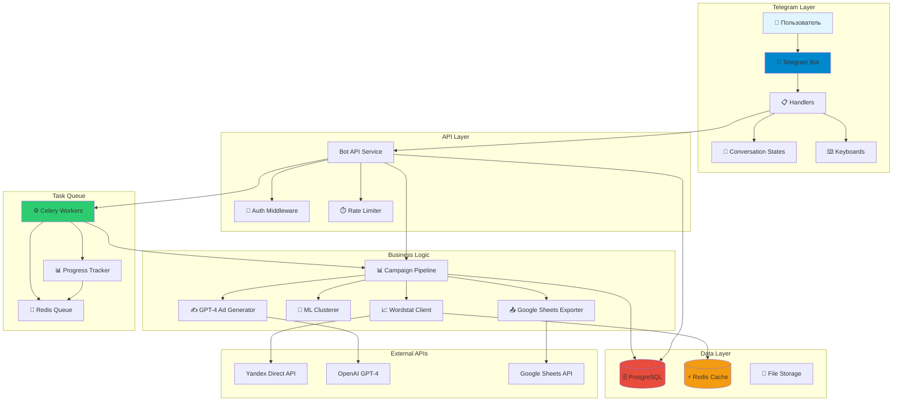
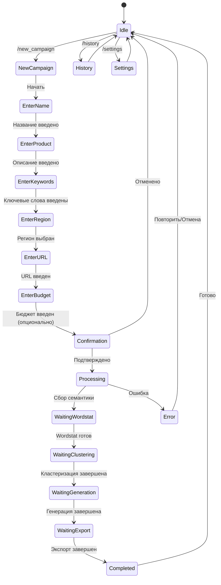
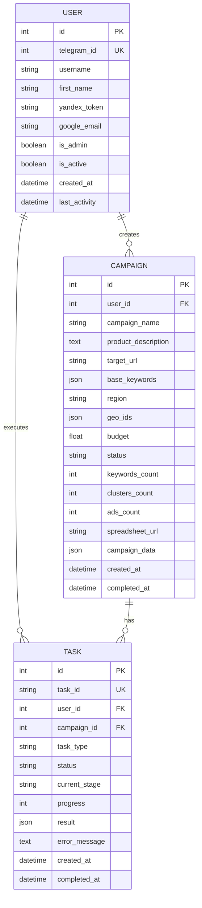

# 🤖 Telegram Bot - Полная архитектура Direct Helper

## 📊 Анализ текущего состояния проекта

### ✅ Что уже реализовано:
- ✅ **Core Pipeline** - полный цикл создания кампаний ([`src/core/pipeline.py`](../src/core/pipeline.py))
- ✅ **Yandex Wordstat API Client** - сбор семантики ([`src/api/yandex_client.py`](../src/api/yandex_client.py))
- ✅ **Keyword Collector** - сбор и фильтрация ключевых слов ([`src/core/semantic/keyword_collector.py`](../src/core/semantic/keyword_collector.py))
- ✅ **Clusterer** - кластеризация ключевых слов ([`src/core/clustering/keyword_clusterer.py`](../src/core/clustering/keyword_clusterer.py))
- ✅ **Ad Generator** - генерация объявлений ([`src/core/generation/ad_generator.py`](../src/core/generation/ad_generator.py))
- ✅ **Google Sheets Exporter** - экспорт в Google Таблицы ([`src/core/export/google_sheets_exporter.py`](../src/core/export/google_sheets_exporter.py))
- ✅ **Campaign Models** - модели данных ([`src/models/campaign.py`](../src/models/campaign.py))
- ✅ **Configuration System** - управление конфигурацией ([`src/utils/config.py`](../src/utils/config.py))
- ✅ **Logging** - система логирования ([`src/utils/logger.py`](../src/utils/logger.py))

### ❌ Что НЕ реализовано:
- ❌ **Telegram Bot** - основной интерфейс пользователя
- ❌ **Database Layer** - хранение кампаний и пользователей (SQLAlchemy в requirements, но не используется)
- ❌ **State Management** - управление состоянием разговора
- ❌ **User Authentication** - аутентификация пользователей
- ❌ **Async Task Queue** - Celery/Redis для фоновых задач (в requirements, но не настроены)
- ❌ **Progress Notifications** - уведомления о прогрессе выполнения
- ❌ **Error Recovery** - восстановление после ошибок
- ❌ **Session Management** - управление сеансами пользователей
- ❌ **Admin Panel** - административный интерфейс

---

## 🐛 Выявленные баги и проблемы

### 1. **Критические проблемы**

#### 1.1 Отсутствие реализации Telegram бота
**Файл:** [`main.py`](../main.py:34-36)
```python
# TODO: Start Telegram bot
logger.info("📱 Telegram bot will be started here")
logger.info("⏸️  Bot implementation pending...")
```
**Проблема:** Главный функционал не реализован, хотя зависимость установлена.

#### 1.2 Несоответствие структуры проекта документации
**Документация:** [`plans/direct-helper-architecture.md`](../plans/direct-helper-architecture.md:136-199) описывает структуру с `bot/` директорией.
**Реальность:** Директория `bot/` отсутствует.

#### 1.3 База данных не реализована
**Конфигурация:** [`config/config.example.yaml`](../config/config.example.yaml:28-31) содержит настройки БД.
**Проблема:** SQLAlchemy в requirements, но нет моделей ORM, миграций или подключения к БД.

#### 1.4 Celery/Redis не настроены
**Requirements:** Celery и Redis в [`requirements.txt`](../requirements.txt:37-38)
**Проблема:** Нет конфигурации, tasks, или интеграции с pipeline.

### 2. **Проблемы производительности**

#### 2.1 Отсутствие кэширования Wordstat API
**Файл:** [`src/api/yandex_client.py`](../src/api/yandex_client.py:265-328)
**Проблема:** Каждый запрос идет в API, нет кэширования результатов. Лимиты API: 10 req/sec.

#### 2.2 Синхронная обработка длительных операций
**Файл:** [`src/core/pipeline.py`](../src/core/pipeline.py:49-125)
**Проблема:** `create_campaign()` выполняется синхронно, блокирует бота на минуты.

#### 2.3 Неэффективная кластеризация
**Файл:** [`src/core/clustering/keyword_clusterer.py`](../src/core/clustering/keyword_clusterer.py:33-111)
**Проблема:** Простой word-overlap алгоритм, не использует ML (хотя scikit-learn и sentence-transformers в requirements).

### 3. **Проблемы безопасности**

#### 3.1 Токены в конфигурации не шифруются
**Файл:** [`config/config.example.yaml`](../config/config.example.yaml:5-19)
**Проблема:** OAuth токены хранятся в plain text, нет шифрования.

#### 3.2 Отсутствие аутентификации пользователей
**Проблема:** Нет проверки прав доступа, любой может использовать бота.

#### 3.3 Отсутствие rate limiting для пользователей
**Проблема:** Пользователь может спамить запросами, исчерпывая квоты API.

### 4. **Логические проблемы**

#### 4.1 Ad Generator не использует GPT-4
**Файл:** [`src/core/generation/ad_generator.py`](../src/core/generation/ad_generator.py:1-177)
**Проблема:** Простые шаблоны вместо GPT-4, хотя OpenAI в requirements и config.

#### 4.2 Нет валидации URL в Campaign
**Файл:** [`src/models/campaign.py`](../src/models/campaign.py:92-112)
**Проблема:** Метод `validate()` не проверяет формат `target_url`.

#### 4.3 Отсутствие обработки ошибок API
**Файл:** [`src/api/yandex_client.py`](../src/api/yandex_client.py:59-122)
**Проблема:** Нет retry logic для временных ошибок API, нет обработки rate limit errors.

#### 4.4 Pipeline не сохраняет промежуточные результаты
**Файл:** [`src/core/pipeline.py`](../src/core/pipeline.py:49-125)
**Проблема:** При сбое на любом этапе теряется весь прогресс.

### 5. **Проблемы UX**

#### 5.1 Нет уведомлений о прогрессе
**Проблема:** Пользователь не знает, что происходит во время долгих операций (2-5 минут).

#### 5.2 Нет возможности отменить операцию
**Проблема:** Запущенную кампанию нельзя остановить.

#### 5.3 Нет истории кампаний
**Проблема:** Пользователь не может просмотреть предыдущие кампании.

---

## 🏗️ Оптимизированная архитектура

### Архитектурная диаграмма



---

## 📁 Оптимизированная структура проекта

```
direct-helper/
├── src/
│   ├── bot/                           # 🆕 Telegram Bot
│   │   ├── __init__.py
│   │   ├── app.py                    # Главный файл бота
│   │   ├── config.py                 # Bot configuration
│   │   ├── handlers/                 # Обработчики команд
│   │   │   ├── __init__.py
│   │   │   ├── start.py             # /start, /help
│   │   │   ├── campaign.py          # Создание кампаний
│   │   │   ├── history.py           # История кампаний
│   │   │   ├── settings.py          # Настройки пользователя
│   │   │   ├── admin.py             # Админ команды
│   │   │   └── errors.py            # Обработка ошибок
│   │   ├── middlewares/             # Middlewares
│   │   │   ├── __init__.py
│   │   │   ├── auth.py              # 🆕 Аутентификация
│   │   │   ├── rate_limit.py        # 🆕 Rate limiting
│   │   │   ├── logging.py           # Логирование
│   │   │   └── error_handler.py     # Обработка ошибок
│   │   ├── keyboards/               # Клавиатуры
│   │   │   ├── __init__.py
│   │   │   ├── inline.py            # Inline кнопки
│   │   │   └── reply.py             # Reply клавиатуры
│   │   ├── states/                  # 🆕 Состояния FSM
│   │   │   ├── __init__.py
│   │   │   ├── campaign.py          # Состояния создания кампании
│   │   │   └── settings.py          # Состояния настроек
│   │   ├── utils/                   # Утилиты бота
│   │   │   ├── __init__.py
│   │   │   ├── validators.py        # Валидация ввода
│   │   │   ├── formatters.py        # Форматирование сообщений
│   │   │   └── notifications.py     # 🆕 Уведомления о прогрессе
│   │   └── filters/                 # 🆕 Фильтры сообщений
│   │       ├── __init__.py
│   │       ├── admin.py             # Фильтр админа
│   │       └── subscription.py      # Фильтр подписки
│   │
│   ├── core/                         # Существующая бизнес-логика
│   │   ├── pipeline.py              # ⚠️ REFACTOR: Добавить async
│   │   ├── semantic/
│   │   ├── clustering/              # ⚠️ REFACTOR: ML clustering
│   │   ├── generation/              # ⚠️ REFACTOR: GPT-4 integration
│   │   └── export/
│   │
│   ├── api/                          # API клиенты
│   │   ├── yandex_client.py         # ⚠️ REFACTOR: Добавить retry logic
│   │   ├── openai_client.py         # 🆕 OpenAI GPT-4 клиент
│   │   └── cache.py                 # 🆕 Кэширование API
│   │
│   ├── database/                     # 🆕 База данных
│   │   ├── __init__.py
│   │   ├── connection.py            # Подключение к БД
│   │   ├── models/                  # ORM модели
│   │   │   ├── __init__.py
│   │   │   ├── user.py              # Модель пользователя
│   │   │   ├── campaign.py          # Модель кампании
│   │   │   ├── task.py              # Модель задачи
│   │   │   └── subscription.py      # Модель подписки
│   │   ├── repositories/            # Репозитории
│   │   │   ├── __init__.py
│   │   │   ├── user.py
│   │   │   ├── campaign.py
│   │   │   └── task.py
│   │   └── migrations/              # Alembic миграции
│   │       └── versions/
│   │
│   ├── tasks/                        # 🆕 Celery tasks
│   │   ├── __init__.py
│   │   ├── celery_app.py            # Celery приложение
│   │   ├── campaign_tasks.py        # Задачи создания кампаний
│   │   ├── notification_tasks.py    # Задачи уведомлений
│   │   └── cleanup_tasks.py         # Задачи очистки
│   │
│   ├── services/                     # 🆕 Бизнес-сервисы
│   │   ├── __init__.py
│   │   ├── campaign_service.py      # Сервис кампаний
│   │   ├── user_service.py          # Сервис пользователей
│   │   ├── notification_service.py  # Сервис уведомлений
│   │   └── analytics_service.py     # Аналитика
│   │
│   ├── models/                       # Существующие dataclasses
│   │   └── campaign.py              # ⚠️ REFACTOR: Добавить валидацию URL
│   │
│   └── utils/                        # Утилиты
│       ├── config.py
│       ├── logger.py
│       ├── encryption.py            # 🆕 Шифрование токенов
│       ├── retry.py                 # 🆕 Retry logic
│       └── validators.py            # 🆕 Валидаторы
│
├── config/
│   ├── config.yaml                  # ⚠️ REFACTOR: Убрать токены
│   ├── celery_config.py             # 🆕 Конфигурация Celery
│   └── database_config.py           # 🆕 Конфигурация БД
│
├── alembic.ini                       # 🆕 Конфигурация миграций
├── docker-compose.yml                # 🆕 Docker Compose
├── Dockerfile                        # 🆕 Dockerfile
├── .env.example                      # 🆕 Пример переменных окружения
└── main.py                           # ⚠️ REFACTOR: Запуск бота
```

**Легенда:**
- 🆕 - Новый файл/директория
- ⚠️ REFACTOR - Требует рефакторинга
- ✅ - Уже реализовано

---

## 🔄 Conversation Flow (FSM)

### Диаграмма состояний



### Определение состояний

```python
# src/bot/states/campaign.py
from telegram.ext import ConversationHandler

class CampaignStates:
    """States for campaign creation conversation"""
    
    # Initial states
    IDLE = ConversationHandler.END
    NEW_CAMPAIGN = 0
    
    # Input states
    ENTER_NAME = 1
    ENTER_PRODUCT = 2
    ENTER_KEYWORDS = 3
    ENTER_REGION = 4
    ENTER_URL = 5
    ENTER_BUDGET = 6
    
    # Confirmation
    CONFIRMATION = 7
    
    # Processing states
    PROCESSING = 8
    WAITING_WORDSTAT = 9
    WAITING_CLUSTERING = 10
    WAITING_GENERATION = 11
    WAITING_EXPORT = 12
    
    # Terminal states
    COMPLETED = 13
    ERROR = 14
```

---

## 🎯 Структура handlers

### 1. Start Handler

**Файл:** `src/bot/handlers/start.py`

```python
async def start_handler(update: Update, context: ContextTypes.DEFAULT_TYPE):
    """Handle /start command"""
    user = update.effective_user
    
    # Check if user exists in database
    user_service = UserService()
    db_user = await user_service.get_or_create_user(
        telegram_id=user.id,
        username=user.username,
        first_name=user.first_name
    )
    
    welcome_message = (
        f"👋 Привет, {user.first_name}!\n\n"
        "🤖 Я Direct Helper - ваш помощник для создания рекламных кампаний Яндекс.Директ.\n\n"
        "Что я умею:\n"
        "✅ Собирать семантику из Wordstat\n"
        "✅ Кластеризовать ключевые слова\n"
        "✅ Генерировать тексты объявлений\n"
        "✅ Экспортировать в Google Таблицы\n\n"
        "Выберите действие:"
    )
    
    keyboard = InlineKeyboardMarkup([
        [InlineKeyboardButton("📝 Создать кампанию", callback_data="new_campaign")],
        [InlineKeyboardButton("📋 Мои кампании", callback_data="history")],
        [InlineKeyboardButton("⚙️ Настройки", callback_data="settings")],
        [InlineKeyboardButton("ℹ️ Справка", callback_data="help")]
    ])
    
    await update.message.reply_text(welcome_message, reply_markup=keyboard)
```

### 2. Campaign Handler

**Файл:** `src/bot/handlers/campaign.py`

**Основные функции:**
- `start_campaign()` - Начало создания кампании
- `enter_name()` - Ввод названия
- `enter_product()` - Ввод описания продукта
- `enter_keywords()` - Ввод базовых ключевых слов
- `select_region()` - Выбор региона
- `enter_url()` - Ввод URL
- `enter_budget()` - Ввод бюджета (опционально)
- `show_confirmation()` - Показ подтверждения
- `process_campaign()` - Запуск обработки
- `cancel_campaign()` - Отмена создания

### 3. Progress Notifications

**Файл:** `src/bot/utils/notifications.py`

```python
async def send_progress_update(
    chat_id: int,
    task_id: str,
    stage: str,
    progress: int,
    message: str
):
    """Send progress notification to user"""
    
    progress_bar = create_progress_bar(progress)
    
    stages = {
        'wordstat': '📊 Сбор семантики',
        'clustering': '🔄 Кластеризация',
        'generation': '✍️ Генерация объявлений',
        'export': '📤 Экспорт в Google Sheets'
    }
    
    text = (
        f"{stages.get(stage, stage)}\n"
        f"{progress_bar} {progress}%\n\n"
        f"{message}"
    )
    
    await bot.edit_message_text(
        chat_id=chat_id,
        message_id=context.user_data['progress_message_id'],
        text=text
    )
```

---

## 🗄️ База данных

### Модели

#### 1. User Model

**Файл:** `src/database/models/user.py`

```python
from sqlalchemy import Column, Integer, String, DateTime, Boolean
from sqlalchemy.orm import relationship
from datetime import datetime

class User(Base):
    __tablename__ = 'users'
    
    id = Column(Integer, primary_key=True)
    telegram_id = Column(Integer, unique=True, nullable=False, index=True)
    username = Column(String(255), nullable=True)
    first_name = Column(String(255), nullable=True)
    last_name = Column(String(255), nullable=True)
    
    # API tokens (encrypted)
    yandex_token = Column(String(500), nullable=True)
    google_email = Column(String(255), nullable=True)
    
    # Settings
    is_admin = Column(Boolean, default=False)
    is_active = Column(Boolean, default=True)
    language = Column(String(10), default='ru')
    
    # Limits
    campaigns_limit = Column(Integer, default=10)
    campaigns_count = Column(Integer, default=0)
    
    # Timestamps
    created_at = Column(DateTime, default=datetime.utcnow)
    updated_at = Column(DateTime, default=datetime.utcnow, onupdate=datetime.utcnow)
    last_activity = Column(DateTime, default=datetime.utcnow)
    
    # Relationships
    campaigns = relationship("Campaign", back_populates="user", cascade="all, delete-orphan")
    tasks = relationship("Task", back_populates="user", cascade="all, delete-orphan")
```

#### 2. Campaign Model

**Файл:** `src/database/models/campaign.py`

```python
class Campaign(Base):
    __tablename__ = 'campaigns'
    
    id = Column(Integer, primary_key=True)
    user_id = Column(Integer, ForeignKey('users.id'), nullable=False)
    
    # Campaign data
    campaign_name = Column(String(255), nullable=False)
    product_description = Column(Text, nullable=True)
    target_url = Column(String(500), nullable=False)
    base_keywords = Column(JSON, nullable=False)  # List of keywords
    
    # Settings
    region = Column(String(100), nullable=True)
    geo_ids = Column(JSON, nullable=True)  # List of Yandex geo IDs
    budget = Column(Float, nullable=True)
    
    # Status
    status = Column(String(50), default='draft')  # draft, processing, completed, failed, archived
    
    # Results
    keywords_count = Column(Integer, default=0)
    clusters_count = Column(Integer, default=0)
    ads_count = Column(Integer, default=0)
    spreadsheet_url = Column(String(500), nullable=True)
    
    # Data storage
    campaign_data = Column(JSON, nullable=True)  # Full campaign data
    
    # Timestamps
    created_at = Column(DateTime, default=datetime.utcnow)
    updated_at = Column(DateTime, default=datetime.utcnow, onupdate=datetime.utcnow)
    completed_at = Column(DateTime, nullable=True)
    
    # Relationships
    user = relationship("User", back_populates="campaigns")
    tasks = relationship("Task", back_populates="campaign", cascade="all, delete-orphan")
```

#### 3. Task Model

**Файл:** `src/database/models/task.py`

```python
class Task(Base):
    __tablename__ = 'tasks'
    
    id = Column(Integer, primary_key=True)
    task_id = Column(String(255), unique=True, nullable=False, index=True)  # Celery task ID
    user_id = Column(Integer, ForeignKey('users.id'), nullable=False)
    campaign_id = Column(Integer, ForeignKey('campaigns.id'), nullable=True)
    
    # Task info
    task_type = Column(String(50), nullable=False)  # campaign_creation, export, etc.
    status = Column(String(50), default='pending')  # pending, running, completed, failed, cancelled
    
    # Progress tracking
    current_stage = Column(String(50), nullable=True)  # wordstat, clustering, generation, export
    progress = Column(Integer, default=0)  # 0-100
    
    # Results and errors
    result = Column(JSON, nullable=True)
    error_message = Column(Text, nullable=True)
    
    # Timestamps
    created_at = Column(DateTime, default=datetime.utcnow)
    started_at = Column(DateTime, nullable=True)
    completed_at = Column(DateTime, nullable=True)
    
    # Relationships
    user = relationship("User", back_populates="tasks")
    campaign = relationship("Campaign", back_populates="tasks")
```

### Схема базы данных



---

## ⚙️ Celery Tasks (Асинхронная обработка)

### Конфигурация Celery

**Файл:** `src/tasks/celery_app.py`

```python
from celery import Celery
from src.utils.config import get_config

config = get_config()

celery_app = Celery(
    'direct_helper',
    broker=config.get('celery.broker_url', 'redis://localhost:6379/0'),
    backend=config.get('celery.result_backend', 'redis://localhost:6379/0'),
    include=[
        'src.tasks.campaign_tasks',
        'src.tasks.notification_tasks',
        'src.tasks.cleanup_tasks'
    ]
)

celery_app.conf.update(
    task_serializer='json',
    accept_content=['json'],
    result_serializer='json',
    timezone='Europe/Moscow',
    enable_utc=True,
    task_track_started=True,
    task_time_limit=3600,  # 1 hour
    task_soft_time_limit=3000,  # 50 minutes
    worker_max_tasks_per_child=100,
)
```

### Campaign Creation Task

**Файл:** `src/tasks/campaign_tasks.py`

```python
from celery import Task
from src.tasks.celery_app import celery_app
from src.core.pipeline import CampaignPipeline
from src.database.repositories.campaign import CampaignRepository
from src.database.repositories.task import TaskRepository
from src.bot.utils.notifications import send_progress_update
import logging

logger = logging.getLogger(__name__)

class CampaignCreationTask(Task):
    """Base task with progress tracking"""
    
    def on_failure(self, exc, task_id, args, kwargs, einfo):
        """Handle task failure"""
        chat_id = kwargs.get('chat_id')
        if chat_id:
            # Send error notification
            send_error_notification(chat_id, str(exc))

@celery_app.task(
    bind=True,
    base=CampaignCreationTask,
    name='create_campaign',
    max_retries=3
)
def create_campaign_task(
    self,
    campaign_id: int,
    chat_id: int,
    user_email: str = None
):
    """
    Async campaign creation task
    
    Args:
        self: Task instance (auto-injected by bind=True)
        campaign_id: Database campaign ID
        chat_id: Telegram chat ID for notifications
        user_email: Email for Google Sheets sharing
    """
    try:
        # Update task status
        task_repo = TaskRepository()
        task_repo.update_task_status(
            task_id=self.request.id,
            status='running',
            current_stage='initialization'
        )
        
        # Get campaign data
        campaign_repo = CampaignRepository()
        campaign = campaign_repo.get_by_id(campaign_id)
        
        if not campaign:
            raise ValueError(f"Campaign {campaign_id} not found")
        
        # Initialize pipeline
        pipeline = CampaignPipeline(
            # ... initialize components
        )
        
        # Stage 1: Collect keywords (0-25%)
        send_progress_update(
            chat_id=chat_id,
            task_id=self.request.id,
            stage='wordstat',
            progress=0,
            message="Начинаем сбор семантики из Wordstat..."
        )
        
        keywords = pipeline._collect_keywords(
            base_phrases=campaign.base_keywords,
            geo_ids=campaign.geo_ids,
            min_frequency=1000,
            max_keywords=100
        )
        
        send_progress_update(
            chat_id=chat_id,
            task_id=self.request.id,
            stage='wordstat',
            progress=25,
            message=f"✅ Собрано {len(keywords)} ключевых слов"
        )
        
        # Stage 2: Clustering (25-50%)
        send_progress_update(
            chat_id=chat_id,
            task_id=self.request.id,
            stage='clustering',
            progress=25,
            message="Кластеризация ключевых слов..."
        )
        
        clusters = pipeline._cluster_keywords(keywords)
        
        send_progress_update(
            chat_id=chat_id,
            task_id=self.request.id,
            stage='clustering',
            progress=50,
            message=f"✅ Создано {len(clusters)} кластеров"
        )
        
        # Stage 3: Generate ads (50-75%)
        send_progress_update(
            chat_id=chat_id,
            task_id=self.request.id,
            stage='generation',
            progress=50,
            message="Генерация текстов объявлений с помощью GPT-4..."
        )
        
        clusters_with_ads = pipeline._generate_ads(clusters, ads_per_cluster=2)
        
        total_ads = sum(len(c.get('ads', [])) for c in clusters_with_ads)
        
        send_progress_update(
            chat_id=chat_id,
            task_id=self.request.id,
            stage='generation',
            progress=75,
            message=f"✅ Сгенерировано {total_ads} объявлений"
        )
        
        # Stage 4: Export (75-100%)
        send_progress_update(
            chat_id=chat_id,
            task_id=self.request.id,
            stage='export',
            progress=75,
            message="Экспорт в Google Таблицы..."
        )
        
        campaign_obj = pipeline._build_campaign(
            campaign_name=campaign.campaign_name,
            target_url=campaign.target_url,
            clusters=clusters_with_ads,
            budget=campaign.budget,
            region=campaign.region
        )
        
        spreadsheet_info = pipeline.sheets_exporter.export_campaign(
            campaign_data=campaign_obj.to_dict(),
            user_email=user_email
        )
        
        send_progress_update(
            chat_id=chat_id,
            task_id=self.request.id,
            stage='export',
            progress=100,
            message="✅ Экспорт завершен!"
        )
        
        # Update campaign in database
        campaign_repo.update_campaign(
            campaign_id=campaign_id,
            status='completed',
            keywords_count=len(keywords),
            clusters_count=len(clusters),
            ads_count=total_ads,
            spreadsheet_url=spreadsheet_info['url'],
            campaign_data=campaign_obj.to_dict()
        )
        
        # Update task
        task_repo.update_task_status(
            task_id=self.request.id,
            status='completed',
            progress=100,
            result={
                'spreadsheet_url': spreadsheet_info['url'],
                'keywords_count': len(keywords),
                'clusters_count': len(clusters),
                'ads_count': total_ads
            }
        )
        
        # Send completion notification
        send_completion_notification(
            chat_id=chat_id,
            campaign_name=campaign.campaign_name,
            spreadsheet_url=spreadsheet_info['url'],
            stats={
                'keywords': len(keywords),
                'clusters': len(clusters),
                'ads': total_ads
            }
        )
        
        return {
            'success': True,
            'campaign_id': campaign_id,
            'spreadsheet_url': spreadsheet_info['url']
        }
        
    except Exception as e:
        logger.error(f"Campaign creation failed: {e}", exc_info=True)
        
        # Update task and campaign status
        task_repo.update_task_status(
            task_id=self.request.id,
            status='failed',
            error_message=str(e)
        )
        
        campaign_repo.update_campaign(
            campaign_id=campaign_id,
            status='failed'
        )
        
        raise
```

---

## 🔐 Безопасность

### 1. Middleware аутентификации

**Файл:** `src/bot/middlewares/auth.py`

```python
from telegram import Update
from telegram.ext import ContextTypes
from src.database.repositories.user import UserRepository
import logging

logger = logging.getLogger(__name__)

class AuthMiddleware:
    """Authentication middleware"""
    
    def __init__(self):
        self.user_repo = UserRepository()
    
    async def __call__(
        self,
        update: Update,
        context: ContextTypes.DEFAULT_TYPE,
        handler
    ):
        """Check user authentication"""
        user = update.effective_user
        
        if not user:
            logger.warning("Update without user")
            return
        
        # Check if user is blocked
        db_user = self.user_repo.get_by_telegram_id(user.id)
        
        if db_user and not db_user.is_active:
            await update.message.reply_text(
                "❌ Ваш аккаунт заблокирован. "
                "Обратитесь к администратору."
            )
            return
        
        # Update last activity
        if db_user:
            self.user_repo.update_last_activity(db_user.id)
        
        # Continue to handler
        return await handler(update, context)
```

### 2. Rate Limiting

**Файл:** `src/bot/middlewares/rate_limit.py`

```python
from telegram import Update
from telegram.ext import ContextTypes
import redis
import time
from src.utils.config import get_config

config = get_config()
redis_client = redis.Redis.from_url(config.get('redis.url', 'redis://localhost:6379/1'))

class RateLimiter:
    """Rate limiting middleware"""
    
    def __init__(self, max_requests: int = 10, window: int = 60):
        """
        Args:
            max_requests: Maximum requests per window
            window: Time window in seconds
        """
        self.max_requests = max_requests
        self.window = window
    
    async def __call__(
        self,
        update: Update,
        context: ContextTypes.DEFAULT_TYPE,
        handler
    ):
        """Check rate limit"""
        user_id = update.effective_user.id
        key = f"ratelimit:{user_id}"
        
        # Get current count
        current = redis_client.get(key)
        
        if current is None:
            # First request in window
            redis_client.setex(key, self.window, 1)
        else:
            count = int(current)
            
            if count >= self.max_requests:
                # Rate limit exceeded
                await update.message.reply_text(
                    "⏱️ Слишком много запросов. "
                    f"Попробуйте через {self.window} секунд."
                )
                return
            
            # Increment counter
            redis_client.incr(key)
        
        # Continue to handler
        return await handler(update, context)
```

### 3. Шифрование токенов

**Файл:** `src/utils/encryption.py`

```python
from cryptography.fernet import Fernet
from src.utils.config import get_config
import base64

config = get_config()

class TokenEncryption:
    """Encrypt/decrypt sensitive tokens"""
    
    def __init__(self):
        # Get encryption key from environment
        key = config.get('security.encryption_key')
        
        if not key:
            raise ValueError("Encryption key not configured")
        
        self.cipher = Fernet(key.encode())
    
    def encrypt(self, token: str) -> str:
        """Encrypt token"""
        encrypted = self.cipher.encrypt(token.encode())
        return base64.b64encode(encrypted).decode()
    
    def decrypt(self, encrypted_token: str) -> str:
        """Decrypt token"""
        decoded = base64.b64decode(encrypted_token.encode())
        decrypted = self.cipher.decrypt(decoded)
        return decrypted.decode()
```

---

## 🎨 Клавиатуры и UI

### Inline Keyboards

**Файл:** `src/bot/keyboards/inline.py`

```python
from telegram import InlineKeyboardButton, InlineKeyboardMarkup

def main_menu_keyboard() -> InlineKeyboardMarkup:
    """Main menu keyboard"""
    return InlineKeyboardMarkup([
        [InlineKeyboardButton("📝 Создать кампанию", callback_data="new_campaign")],
        [InlineKeyboardButton("📋 Мои кампании", callback_data="history")],
        [InlineKeyboardButton("⚙️ Настройки", callback_data="settings")],
        [InlineKeyboardButton("ℹ️ Справка", callback_data="help")]
    ])

def confirmation_keyboard() -> InlineKeyboardMarkup:
    """Campaign confirmation keyboard"""
    return InlineKeyboardMarkup([
        [InlineKeyboardButton("✅ Создать кампанию", callback_data="confirm_create")],
        [InlineKeyboardButton("✏️ Изменить", callback_data="edit_campaign")],
        [InlineKeyboardButton("❌ Отменить", callback_data="cancel_campaign")]
    ])

def region_keyboard() -> InlineKeyboardMarkup:
    """Region selection keyboard"""
    regions = [
        ("🇷🇺 Вся Россия", "region_225"),
        ("🏙️ Москва", "region_213"),
        ("🏙️ Санкт-Петербург", "region_2"),
        ("🏙️ Екатеринбург", "region_54"),
        ("🏙️ Новосибирск", "region_65"),
        ("🏙️ Казань", "region_43")
    ]
    
    keyboard = [[InlineKeyboardButton(name, callback_data=code)] for name, code in regions]
    keyboard.append([InlineKeyboardButton("↩️ Назад", callback_data="back")])
    
    return InlineKeyboardMarkup(keyboard)

def campaign_actions_keyboard(campaign_id: int) -> InlineKeyboardMarkup:
    """Actions for specific campaign"""
    return InlineKeyboardMarkup([
        [InlineKeyboardButton("📄 Открыть таблицу", callback_data=f"open_{campaign_id}")],
        [InlineKeyboardButton("📊 Статистика", callback_data=f"stats_{campaign_id}")],
        [InlineKeyboardButton("🔄 Повторить", callback_data=f"repeat_{campaign_id}")],
        [InlineKeyboardButton("🗑️ Удалить", callback_data=f"delete_{campaign_id}")],
        [InlineKeyboardButton("↩️ Назад", callback_data="back_to_history")]
    ])
```

---

## 📋 Итоговый план реализации

### Фаза 1: Подготовка инфраструктуры

**Задачи:**
- [ ] Создать структуру директорий для бота (`src/bot/`)
- [ ] Настроить PostgreSQL (или SQLite для начала)
- [ ] Создать ORM модели (User, Campaign, Task)
- [ ] Настроить Alembic миграции
- [ ] Настроить Redis для кэширования и очередей
- [ ] Создать базовую конфигурацию Celery
- [ ] Добавить `.env` файл для переменных окружения
- [ ] Создать Docker Compose для локальной разработки

### Фаза 2: Реализация базового бота

**Задачи:**
- [ ] Создать главный файл бота (`src/bot/app.py`)
- [ ] Реализовать `/start` команду
- [ ] Реализовать `/help` команду
- [ ] Создать главное меню с inline клавиатурой
- [ ] Реализовать middleware аутентификации
- [ ] Реализовать middleware rate limiting
- [ ] Реализовать middleware логирования
- [ ] Протестировать базовую работу бота

### Фаза 3: Conversation Flow для создания кампаний

**Задачи:**
- [ ] Создать FSM состояния (`src/bot/states/campaign.py`)
- [ ] Реализовать handler начала создания кампании
- [ ] Реализовать ввод названия кампании
- [ ] Реализовать ввод описания продукта
- [ ] Реализовать ввод базовых ключевых слов
- [ ] Реализовать выбор региона
- [ ] Реализовать ввод target URL с валидацией
- [ ] Реализовать опциональный ввод бюджета
- [ ] Реализовать экран подтверждения
- [ ] Реализовать отмену создания на любом этапе

### Фаза 4: Интеграция с Celery

**Задачи:**
- [ ] Создать Celery app (`src/tasks/celery_app.py`)
- [ ] Создать task для создания кампании (`src/tasks/campaign_tasks.py`)
- [ ] Интегрировать progress tracking с Redis
- [ ] Реализовать отправку уведомлений о прогрессе в Telegram
- [ ] Реализовать обработку ошибок в tasks
- [ ] Реализовать retry logic для API calls
- [ ] Добавить таймауты и ограничения по времени
- [ ] Протестировать асинхронную обработку

### Фаза 5: Улучшение core модулей

**Задачи:**
- [ ] Рефакторинг [`src/core/pipeline.py`](../src/core/pipeline.py) для поддержки async
- [ ] Добавить кэширование в [`src/api/yandex_client.py`](../src/api/yandex_client.py)
- [ ] Добавить retry logic в Yandex API client
- [ ] Создать GPT-4 клиент для генерации объявлений
- [ ] Улучшить кластеризацию с использованием ML (sentence-transformers)
- [ ] Добавить валидацию URL в [`src/models/campaign.py`](../src/models/campaign.py)
- [ ] Реализовать сохранение промежуточных результатов
- [ ] Добавить тесты для всех компонентов

### Фаза 6: История кампаний

**Задачи:**
- [ ] Создать handler истории (`src/bot/handlers/history.py`)
- [ ] Реализовать список кампаний с пагинацией
- [ ] Реализовать просмотр деталей кампании
- [ ] Реализовать открытие Google Sheets
- [ ] Реализовать повторное создание кампании
- [ ] Реализовать удаление кампании
- [ ] Реализовать фильтры (по статусу, дате)
- [ ] Добавить статистику по кампаниям

### Фаза 7: Настройки пользователя

**Задачи:**
- [ ] Создать handler настроек (`src/bot/handlers/settings.py`)
- [ ] Реализовать ввод/изменение Yandex OAuth token
- [ ] Реализовать ввод/изменение Google email для sharing
- [ ] Реализовать выбор языка (ru/en)
- [ ] Реализовать настройки по умолчанию (регион, бюджет)
- [ ] Реализовать просмотр лимитов
- [ ] Добавить шифрование для токенов в БД

### Фаза 8: Административный функционал

**Задачи:**
- [ ] Создать admin handler (`src/bot/handlers/admin.py`)
- [ ] Реализовать просмотр статистики пользователей
- [ ] Реализовать блокировку/разблокировку пользователей
- [ ] Реализовать изменение лимитов
- [ ] Реализовать рассылку сообщений
- [ ] Реализовать просмотр логов
- [ ] Добавить мониторинг Celery tasks

### Фаза 9: Безопасность и надежность

**Задачи:**
- [ ] Реализовать шифрование токенов (`src/utils/encryption.py`)
- [ ] Добавить логирование всех действий пользователей
- [ ] Реализовать backup базы данных
- [ ] Настроить мониторинг ошибок (Sentry)
- [ ] Добавить health checks для API
- [ ] Реализовать graceful shutdown
- [ ] Настроить автоматические тесты CI/CD
- [ ] Провести security audit

### Фаза 10: Оптимизация и production-готовность

**Задачи:**
- [ ] Оптимизировать запросы к БД (добавить индексы)
- [ ] Настроить connection pooling
- [ ] Добавить мониторинг производительности
- [ ] Настроить автоматическое масштабирование Celery workers
- [ ] Создать подробную документацию
- [ ] Создать инструкцию по развертыванию
- [ ] Настроить автоматическое резервное копирование
- [ ] Провести нагрузочное тестирование

---

## 🚀 Команды для запуска

### Development

```bash
# 1. Запуск PostgreSQL и Redis
docker-compose up -d postgres redis

# 2. Применить миграции
alembic upgrade head

# 3. Запуск Celery worker
celery -A src.tasks.celery_app worker --loglevel=info

# 4. Запуск Celery beat (для периодических задач)
celery -A src.tasks.celery_app beat --loglevel=info

# 5. Запуск Telegram бота
python main.py
```

### Production (Docker)

```bash
# Запуск всех сервисов
docker-compose -f docker-compose.prod.yml up -d

# Просмотр логов
docker-compose logs -f bot

# Остановка
docker-compose down
```

---

## 📊 Метрики и мониторинг

### Ключевые метрики:

1. **Пользовательские метрики:**
   - Количество активных пользователей (DAU, MAU)
   - Количество созданных кампаний
   - Конверсия (start → completed campaign)
   - Средние время создания кампании

2. **Системные метрики:**
   - Uptime бота
   - Количество обработанных сообщений
   - Очередь Celery tasks
   - Использование Redis памяти
   - Использование БД

3. **API метрики:**
   - Количество запросов к Yandex API
   - Количество запросов к OpenAI API
   - Количество запросов к Google Sheets API
   - Rate limit hits
   - Ошибки API

4. **Бизнес метрики:**
   - Среднее количество ключевых слов на кампанию
   - Среднее количество кластеров
   - Среднее количество объявлений
   - Стоимость на кампанию (API costs)

---

## 🎯 Финальный сценарий реализации

### Рекомендуемая последовательность:

**Неделя 1-2: Инфраструктура и база**
- Настройка БД, Redis, Celery
- ORM модели и миграции
- Docker Compose для dev
- **Результат:** Готовая инфраструктура

**Неделя 3-4: Базовый бот**
- Главный файл бота
- Основные команды (/start, /help)
- Middleware (auth, rate limit)
- Главное меню
- **Результат:** Работающий базовый бот

**Неделя 5-7: Создание кампаний**
- FSM conversation flow
- Все этапы ввода данных
- Валидация и подтверждение
- Интеграция с Celery
- Progress notifications
- **Результат:** Полный цикл создания кампании

**Неделя 8-9: Улучшение core**
- Async pipeline
- GPT-4 integration
- ML clustering
- Кэширование API
- **Результат:** Качественная генерация

**Неделя 10-11: История и настройки**
- История кампаний
- Настройки пользователя
- Повтор/удаление кампаний
- **Результат:** Полный user experience

**Неделя 12-13: Безопасность и admin**
- Шифрование токенов
- Админ панель
- Логирование и мониторинг
- **Результат:** Production-ready безопасность

**Неделя 14-15: Тестирование и деплой**
- Юнит тесты
- Интеграционные тесты
- Нагрузочное тестирование
- Production деплой
- **Результат:** Запущенный production бот

---

## 📝 Заключение

### Ключевые улучшения:

1. **Асинхронная обработка** - Celery для длительных операций
2. **Прогресс-бар** - Пользователь видит прогресс в реальном времени
3. **База данных** - История кампаний и пользователей
4. **Безопасность** - Аутентификация, rate limiting, шифрование
5. **GPT-4 интеграция** - Качественная генерация объявлений
6. **ML кластеризация** - Более точное группирование ключевых слов
7. **Кэширование** - Экономия запросов к API
8. **Надежность** - Retry logic, error recovery

### Ожидаемые результаты:

- ⏱️ Время создания кампании: 3-5 минут (с уведомлениями)
- 📊 Качество объявлений: Высокое (GPT-4)
- 🎯 Точность кластеризации: Высокая (ML)
- 🔒 Безопасность: Enterprise-level
- 📈 Масштабируемость: До 1000 пользователей
- 💰 Стоимость на кампанию: ~$0.10-0.20 (API costs)

### Следующие шаги:

1. ✅ Согласовать архитектуру
2. ✅ Получить API credentials
3. ✅ Начать с Фазы 1
4. ✅ Итеративная разработка и тестирование
