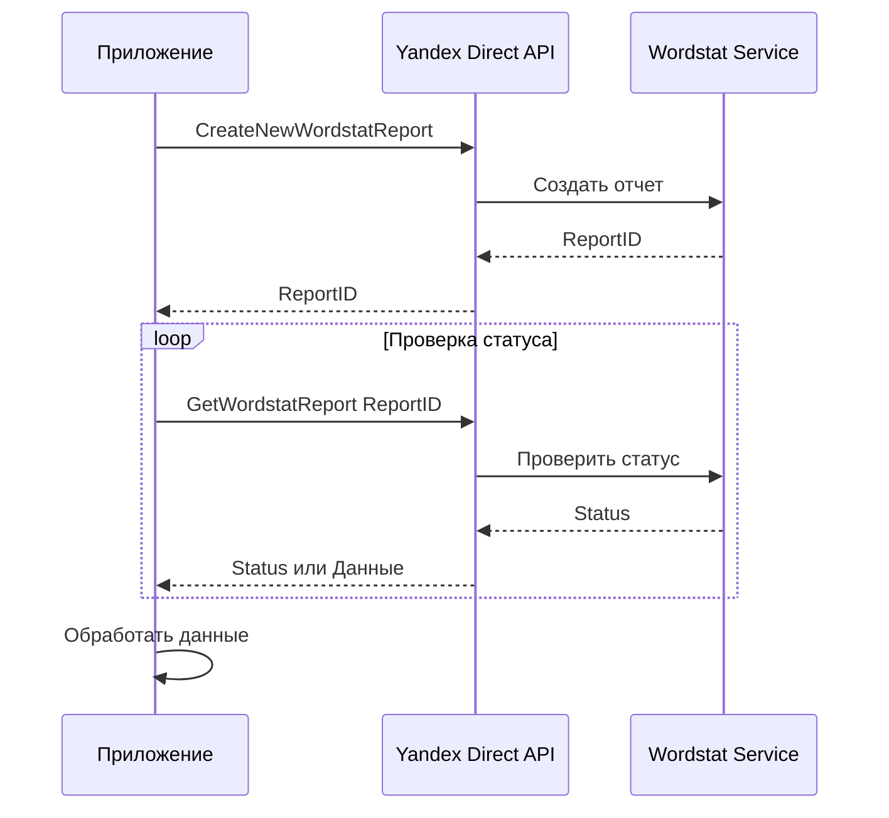

# 🔌 Детальное руководство по интеграции с Yandex Wordstat API

## Обзор Yandex Direct API v5

Yandex Direct API v5 предоставляет доступ к различным сервисам, включая работу с кампаниями, объявлениями, и статистикой. Для нашего проекта основной интерес представляет **сервис Wordstat** для получения данных о частоте поисковых запросов.

---

## Шаг 1: Регистрация приложения и получение OAuth токена

### 1.1. Создание приложения

1. Перейдите на https://oauth.yandex.ru/
2. Нажмите "Зарегистрировать новое приложение"
3. Заполните форму:
   - **Название:** Direct Helper
   - **Платформы:** Выберите "Веб-сервисы"
   - **Redirect URI:** `http://localhost:8080/callback` (для локальной разработки)
   - **Права доступа:** Отметьте `Яндекс.Директ` → `Управление рекламными кампаниями (direct:api)`

4. После создания получите:
   - **Client ID** (идентификатор приложения)
   - **Client Secret** (секретный ключ)

### 1.2. Получение OAuth токена

#### Метод 1: Через браузер (для персонального использования)

```python
# utils/oauth_helper.py
import webbrowser
from http.server import HTTPServer, BaseHTTPRequestHandler
from urllib.parse import urlparse, parse_qs
import requests

CLIENT_ID = "ваш_client_id"
CLIENT_SECRET = "ваш_client_secret"
REDIRECT_URI = "http://localhost:8080/callback"

class OAuthHandler(BaseHTTPRequestHandler):
    def do_GET(self):
        query = urlparse(self.path).query
        params = parse_qs(query)
        
        if 'code' in params:
            auth_code = params['code'][0]
            # Обмениваем код на токен
            token_url = "https://oauth.yandex.ru/token"
            data = {
                'grant_type': 'authorization_code',
                'code': auth_code,
                'client_id': CLIENT_ID,
                'client_secret': CLIENT_SECRET
            }
            
            response = requests.post(token_url, data=data)
            token_data = response.json()
            
            if 'access_token' in token_data:
                print(f"Access Token: {token_data['access_token']}")
                print(f"Refresh Token: {token_data.get('refresh_token')}")
                print(f"Expires in: {token_data.get('expires_in')} seconds")
                
                # Сохраняем токен
                with open('config/yandex_token.txt', 'w') as f:
                    f.write(token_data['access_token'])
            
            self.send_response(200)
            self.send_header('Content-type', 'text/html; charset=utf-8')
            self.end_headers()
            self.wfile.write("✅ Токен получен! Можете закрыть окно.".encode('utf-8'))

def get_oauth_token():
    # Формируем URL для авторизации
    auth_url = (
        f"https://oauth.yandex.ru/authorize?"
        f"response_type=code&"
        f"client_id={CLIENT_ID}&"
        f"redirect_uri={REDIRECT_URI}"
    )
    
    print("Открываю браузер для авторизации...")
    webbrowser.open(auth_url)
    
    # Запускаем локальный сервер для приема колбэка
    server = HTTPServer(('localhost', 8080), OAuthHandler)
    server.handle_request()
    
if __name__ == "__main__":
    get_oauth_token()
```

#### Метод 2: Обновление токена (для долгосрочного использования)

OAuth токены имеют срок действия. Используйте refresh token для обновления:

```python
def refresh_access_token(refresh_token: str) -> str:
    """Обновить access token используя refresh token"""
    token_url = "https://oauth.yandex.ru/token"
    data = {
        'grant_type': 'refresh_token',
        'refresh_token': refresh_token,
        'client_id': CLIENT_ID,
        'client_secret': CLIENT_SECRET
    }
    
    response = requests.post(token_url, data=data)
    token_data = response.json()
    
    return token_data['access_token']
```

---

## Шаг 2: Работа с Wordstat API

### 2.1. Архитектура Wordstat API

Wordstat в Yandex Direct API работает асинхронно:



**Важно:** Отчеты создаются не мгновенно, требуется периодически опрашивать API для получения результата.

### 2.2. Создание отчета Wordstat

**Endpoint:** `https://api.direct.yandex.com/json/v5/wordstat`

**Метод:** `CreateNewWordstatReport`

**Пример реализации:**

```python
# api/yandex.py
import requests
import time
from typing import List, Dict, Optional

class YandexWordstatClient:
    BASE_URL = "https://api.direct.yandex.com/json/v5/wordstat"
    
    def __init__(self, token: str, login: str = None):
        """
        Args:
            token: OAuth токен
            login: Логин рекламодателя (опционально)
        """
        self.token = token
        self.login = login
        self.headers = {
            'Authorization': f'Bearer {token}',
            'Accept-Language': 'ru',
            'Content-Type': 'application/json; charset=utf-8'
        }
        if login:
            self.headers['Client-Login'] = login
    
    def create_report(self, phrases: List[str], geo_ids: List[int] = None) -> int:
        """
        Создать новый отчет Wordstat
        
        Args:
            phrases: Список фраз для анализа (макс 10 за раз)
            geo_ids: ID регионов (например, [213] для Москвы, [1] для Москвы и МО)
        
        Returns:
            ReportID для последующего получения отчета
        """
        if len(phrases) > 10:
            raise ValueError("Максимум 10 фраз за один запрос")
        
        # Формируем запрос
        payload = {
            "method": "CreateNewWordstatReport",
            "params": {
                "Phrases": phrases
            }
        }
        
        # Добавляем гео-таргетинг если указан
        if geo_ids:
            payload["params"]["GeoIds"] = geo_ids
        
        try:
            response = requests.post(
                self.BASE_URL,
                json=payload,
                headers=self.headers,
                timeout=30
            )
            response.raise_for_status()
            
            result = response.json()
            
            if 'error' in result:
                raise Exception(f"API Error: {result['error']}")
            
            report_id = result['result']['ReportID']
            print(f"✅ Отчет создан, ReportID: {report_id}")
            return report_id
            
        except requests.exceptions.RequestException as e:
            print(f"❌ Ошибка запроса: {e}")
            raise
```

**Пример запроса (JSON):**
```json
{
  "method": "CreateNewWordstatReport",
  "params": {
    "Phrases": [
      "купить ноутбук",
      "ноутбук цена",
      "игровой ноутбук"
    ],
    "GeoIds": [213]
  }
}
```

**Пример ответа:**
```json
{
  "result": {
    "ReportID": 12345678
  }
}
```

### 2.3. Получение данных отчета

**Метод:** `GetWordstatReport`

```python
def get_report(self, report_id: int, max_attempts: int = 30, delay: int = 5) -> Optional[List[Dict]]:
    """
    Получить данные отчета Wordstat
    
    Args:
        report_id: ID отчета
        max_attempts: Максимальное количество попыток
        delay: Задержка между попытками (секунды)
    
    Returns:
        Данные отчета или None если отчет не готов
    """
    payload = {
        "method": "GetWordstatReport",
        "params": {
            "ReportID": report_id
        }
    }
    
    for attempt in range(max_attempts):
        try:
            response = requests.post(
                self.BASE_URL,
                json=payload,
                headers=self.headers,
                timeout=30
            )
            response.raise_for_status()
            result = response.json()
            
            # Проверяем на ошибки
            if 'error' in result:
                error_code = result['error'].get('error_code', 0)
                error_msg = result['error'].get('error_string', '')
                
                # Код 25 = отчет еще не готов
                if error_code == 25:
                    print(f"⏳ Отчет не готов, попытка {attempt + 1}/{max_attempts}...")
                    time.sleep(delay)
                    continue
                else:
                    raise Exception(f"API Error {error_code}: {error_msg}")
            
            # Отчет готов
            data = result.get('result', [])
            print(f"✅ Отчет получен, найдено {len(data)} фраз")
            return data
            
        except requests.exceptions.RequestException as e:
            print(f"❌ Ошибка запроса (попытка {attempt + 1}): {e}")
            if attempt < max_attempts - 1:
                time.sleep(delay)
            else:
                raise
    
    print("❌ Превышено время ожидания отчета")
    return None
```

**Пример ответа Wordstat:**
```json
{
  "result": [
    {
      "Phrase": "купить ноутбук",
      "Shows": 245000,
      "SearchedWith": [
        {
          "Phrase": "купить ноутбук москва",
          "Shows": 45000
        },
        {
          "Phrase": "купить ноутбук недорого",
          "Shows": 38000
        },
        {
          "Phrase": "купить игровой ноутбук",
          "Shows": 32000
        }
      ]
    }
  ]
}
```

**Структура ответа:**
- `Phrase` - Исходная фраза из запроса
- `Shows` - Количество показов в месяц по данной фразе
- `SearchedWith` - Массив связанных запросов, которые пользователи искали вместе с этой фразой
  - Каждый элемент содержит `Phrase` (связанный запрос) и `Shows` (его частота)

### 2.4. Удаление отчета

После получения данных рекомендуется удалить отчет для экономии квоты:

```python
def delete_report(self, report_id: int) -> bool:
    """Удалить отчет Wordstat"""
    payload = {
        "method": "DeleteWordstatReport",
        "params": {
            "ReportID": report_id
        }
    }
    
    try:
        response = requests.post(
            self.BASE_URL,
            json=payload,
            headers=self.headers,
            timeout=30
        )
        response.raise_for_status()
        result = response.json()
        
        if 'error' not in result:
            print(f"✅ Отчет {report_id} удален")
            return True
        return False
        
    except Exception as e:
        print(f"❌ Ошибка удаления отчета: {e}")
        return False
```

### 2.5. Получение списка отчетов

Можно получить список всех ваших отчетов:

```python
def get_report_list(self) -> List[Dict]:
    """Получить список всех отчетов Wordstat"""
    payload = {
        "method": "GetWordstatReportList"
    }
    
    try:
        response = requests.post(
            self.BASE_URL,
            json=payload,
            headers=self.headers,
            timeout=30
        )
        response.raise_for_status()
        result = response.json()
        
        if 'result' in result:
            return result['result']
        return []
        
    except Exception as e:
        print(f"❌ Ошибка получения списка отчетов: {e}")
        return []
```

---

## Шаг 3: Полный цикл сбора семантики

### 3.1. Основной класс для работы с семантикой

```python
# core/semantic/wordstat_client.py
import time
from typing import List, Dict, Set
from dataclasses import dataclass

@dataclass
class Keyword:
    phrase: str
    frequency: int
    source: str  # 'base' или 'related'

class SemanticCollector:
    def __init__(self, client: YandexWordstatClient):
        self.client = client
        self.collected_keywords: Set[str] = set()
    
    def collect_semantic(
        self, 
        base_phrases: List[str], 
        geo_ids: List[int] = None,
        min_frequency: int = 100,
        max_keywords: int = 1000,
        expand: bool = True
    ) -> List[Keyword]:
        """
        Собрать полную семантику на основе базовых фраз
        
        Args:
            base_phrases: Базовые ключевые слова
            geo_ids: ID регионов для таргетинга
            min_frequency: Минимальная частота запроса
            max_keywords: Максимальное количество ключевых слов
            expand: Расширять семантику связанными запросами
        
        Returns:
            Список объектов Keyword
        """
        all_keywords = []
        
        # Разбиваем на батчи по 10 фраз (лимит API)
        for i in range(0, len(base_phrases), 10):
            batch = base_phrases[i:i+10]
            
            print(f"📊 Обработка батча {i//10 + 1}: {batch}")
            
            # Создаем отчет
            report_id = self.client.create_report(batch, geo_ids)
            
            # Получаем данные
            report_data = self.client.get_report(report_id)
            
            if report_data:
                # Обрабатываем результаты
                keywords = self._process_report(report_data, min_frequency, expand)
                all_keywords.extend(keywords)
                
                # Удаляем отчет
                self.client.delete_report(report_id)
            
            # Соблюдаем rate limit (не более 10 запросов в секунду)
            time.sleep(0.2)
            
            # Проверяем лимит
            if len(all_keywords) >= max_keywords:
                break
        
        # Удаляем дубликаты и сортируем по частоте
        unique_keywords = self._deduplicate(all_keywords)
        unique_keywords.sort(key=lambda x: x.frequency, reverse=True)
        
        return unique_keywords[:max_keywords]
    
    def _process_report(
        self, 
        report_data: List[Dict], 
        min_frequency: int,
        expand: bool
    ) -> List[Keyword]:
        """Обработать данные отчета"""
        keywords = []
        
        for item in report_data:
            base_phrase = item['Phrase']
            base_frequency = item.get('Shows', 0)
            
            # Добавляем базовую фразу
            if base_frequency >= min_frequency:
                keywords.append(Keyword(
                    phrase=base_phrase,
                    frequency=base_frequency,
                    source='base'
                ))
                self.collected_keywords.add(base_phrase.lower())
            
            # Добавляем связанные запросы
            if expand and 'SearchedWith' in item:
                for related in item['SearchedWith']:
                    related_phrase = related['Phrase']
                    related_frequency = related.get('Shows', 0)
                    
                    if (related_frequency >= min_frequency and 
                        related_phrase.lower() not in self.collected_keywords):
                        
                        keywords.append(Keyword(
                            phrase=related_phrase,
                            frequency=related_frequency,
                            source='related'
                        ))
                        self.collected_keywords.add(related_phrase.lower())
        
        return keywords
    
    def _deduplicate(self, keywords: List[Keyword]) -> List[Keyword]:
        """Удалить дубликаты, оставив вариант с большей частотой"""
        unique = {}
        
        for kw in keywords:
            phrase_lower = kw.phrase.lower()
            if phrase_lower not in unique or kw.frequency > unique[phrase_lower].frequency:
                unique[phrase_lower] = kw
        
        return list(unique.values())
```

### 3.2. Пример использования

```python
# Пример использования в main.py или боте
def example_semantic_collection():
    # Инициализация клиента
    token = "ваш_oauth_токен"
    client = YandexWordstatClient(token)
    collector = SemanticCollector(client)
    
    # Базовые фразы
    base_phrases = [
        "купить ноутбук",
        "ноутбук для работы",
        "игровой ноутбук"
    ]
    
    # Сбор семантики для Москвы
    keywords = collector.collect_semantic(
        base_phrases=base_phrases,
        geo_ids=[213],  # Москва
        min_frequency=100,  # Минимум 100 показов в месяц
        max_keywords=500,
        expand=True  # Собирать связанные запросы
    )
    
    # Выводим результаты
    print(f"\n📊 Собрано {len(keywords)} ключевых слов:\n")
    for kw in keywords[:20]:  # Первые 20
        print(f"- {kw.phrase}: {kw.frequency:,} показов ({kw.source})")
    
    return keywords
```

**Пример вывода:**
```
📊 Обработка батча 1: ['купить ноутбук', 'ноутбук для работы', 'игровой ноутбук']
✅ Отчет создан, ReportID: 12345678
⏳ Отчет не готов, попытка 1/30...
⏳ Отчет не готов, попытка 2/30...
✅ Отчет получен, найдено 3 фраз
✅ Отчет 12345678 удален

📊 Собрано 247 ключевых слов:

- купить ноутбук: 245,000 показов (base)
- купить ноутбук москва: 45,000 показов (related)
- купить ноутбук недорого: 38,000 показов (related)
- игровой ноутбук: 156,000 показов (base)
- ноутбук для работы: 89,000 показов (base)
...
```

---

## Шаг 4: Обработка ошибок и лимитов

### 4.1. Коды ошибок Yandex Direct API

```python
# api/error_codes.py
ERROR_CODES = {
    25: "Отчет еще не готов",
    53: "Превышен лимит запросов",
    54: "Недостаточно средств на счете",
    250: "Неправильный формат параметра",
    500: "Внутренняя ошибка сервера",
    1000: "Ошибка авторизации",
    1001: "Неверный токен",
    1002: "Токен истек",
    2000: "Нет прав доступа",
}

def handle_api_error(error_code: int, error_message: str) -> str:
    """
    Обработка ошибок API
    
    Returns:
        'wait' - нужно подождать и повторить
        'retry' - повторить запрос
        'auth_error' - проблема с авторизацией
        'error' - критическая ошибка
    """
    if error_code == 25:
        # Отчет не готов - это нормально, просто ждем
        return "wait"
    elif error_code == 53:
        # Превышен лимит - ждем дольше
        print("⚠️ Превышен лимит запросов, ждем 60 секунд...")
        time.sleep(60)
        return "retry"
    elif error_code in [1001, 1002]:
        # Проблемы с токеном
        print("❌ Проблема с токеном авторизации")
        return "auth_error"
    elif error_code == 54:
        print("❌ Недостаточно средств на счете Яндекс.Директ")
        return "error"
    else:
        error_desc = ERROR_CODES.get(error_code, "Неизвестная ошибка")
        print(f"❌ Ошибка API {error_code}: {error_desc} - {error_message}")
        return "error"
```

### 4.2. Управление rate limits

```python
# utils/rate_limiter.py
import time
from collections import deque

class RateLimiter:
    """
    Rate limiter для соблюдения ограничений API
    Yandex Direct: максимум 10 запросов в секунду
    """
    def __init__(self, max_requests: int = 10, time_window: int = 1):
        """
        Args:
            max_requests: Максимум запросов
            time_window: Временное окно в секундах
        """
        self.max_requests = max_requests
        self.time_window = time_window
        self.requests = deque()
    
    def wait_if_needed(self):
        """Подождать если нужно соблюсти rate limit"""
        now = time.time()
        
        # Удаляем старые запросы
        while self.requests and self.requests[0] < now - self.time_window:
            self.requests.popleft()
        
        # Если достигли лимита - ждем
        if len(self.requests) >= self.max_requests:
            sleep_time = self.time_window - (now - self.requests[0])
            if sleep_time > 0:
                print(f"⏸️ Rate limit: ждем {sleep_time:.1f} сек...")
                time.sleep(sleep_time)
                self.requests.clear()
        
        # Записываем текущий запрос
        self.requests.append(time.time())

# Использование в клиенте
class YandexWordstatClientWithLimiter(YandexWordstatClient):
    def __init__(self, token: str, login: str = None):
        super().__init__(token, login)
        self.rate_limiter = RateLimiter(max_requests=10, time_window=1)
    
    def create_report(self, phrases: List[str], geo_ids: List[int] = None) -> int:
        self.rate_limiter.wait_if_needed()
        return super().create_report(phrases, geo_ids)
    
    def get_report(self, report_id: int, max_attempts: int = 30, delay: int = 5) -> Optional[List[Dict]]:
        self.rate_limiter.wait_if_needed()
        return super().get_report(report_id, max_attempts, delay)
```

### 4.3. Retry логика с экспоненциальной задержкой

```python
# utils/retry.py
import time
from functools import wraps

def retry_with_backoff(max_retries: int = 3, base_delay: float = 1.0, max_delay: float = 60.0):
    """
    Декоратор для повторных попыток с экспоненциальной задержкой
    
    Args:
        max_retries: Максимальное количество попыток
        base_delay: Базовая задержка в секундах
        max_delay: Максимальная задержка
    """
    def decorator(func):
        @wraps(func)
        def wrapper(*args, **kwargs):
            for attempt in range(max_retries):
                try:
                    return func(*args, **kwargs)
                except Exception as e:
                    if attempt == max_retries - 1:
                        raise
                    
                    delay = min(base_delay * (2 ** attempt), max_delay)
                    print(f"⚠️ Попытка {attempt + 1} не удалась: {e}")
                    print(f"⏳ Повтор через {delay:.1f} сек...")
                    time.sleep(delay)
            
        return wrapper
    return decorator

# Использование
@retry_with_backoff(max_retries=3, base_delay=2.0)
def create_report_with_retry(client, phrases, geo_ids):
    return client.create_report(phrases, geo_ids)
```

---

## Шаг 5: Кэширование результатов

Кэширование помогает снизить количество запросов к API и ускорить работу для повторяющихся запросов.

```python
# utils/cache.py
import json
import hashlib
from pathlib import Path
from datetime import datetime, timedelta
from typing import List, Dict, Optional

class WordstatCache:
    """Кэш для результатов Wordstat"""
    
    def __init__(self, cache_dir: str = "data/cache", ttl_days: int = 7):
        """
        Args:
            cache_dir: Директория для хранения кэша
            ttl_days: Время жизни кэша в днях
        """
        self.cache_dir = Path(cache_dir)
        self.cache_dir.mkdir(parents=True, exist_ok=True)
        self.ttl = timedelta(days=ttl_days)
    
    def _get_cache_key(self, phrases: List[str], geo_ids: List[int] = None) -> str:
        """Генерировать ключ кэша на основе параметров запроса"""
        data = {
            'phrases': sorted(phrases),
            'geo_ids': sorted(geo_ids) if geo_ids else []
        }
        json_str = json.dumps(data, sort_keys=True, ensure_ascii=False)
        return hashlib.md5(json_str.encode()).hexdigest()
    
    def get(self, phrases: List[str], geo_ids: List[int] = None) -> Optional[List[Dict]]:
        """Получить данные из кэша"""
        cache_key = self._get_cache_key(phrases, geo_ids)
        cache_file = self.cache_dir / f"{cache_key}.json"
        
        if cache_file.exists():
            # Проверяем время жизни
            mtime = datetime.fromtimestamp(cache_file.stat().st_mtime)
            if datetime.now() - mtime < self.ttl:
                print(f"💾 Используем кэш для {len(phrases)} фраз")
                with open(cache_file, 'r', encoding='utf-8') as f:
                    return json.load(f)
            else:
                # Удаляем устаревший кэш
                cache_file.unlink()
                print(f"🗑️ Кэш устарел, удален")
        
        return None
    
    def set(self, phrases: List[str], data: List[Dict], geo_ids: List[int] = None):
        """Сохранить данные в кэш"""
        cache_key = self._get_cache_key(phrases, geo_ids)
        cache_file = self.cache_dir / f"{cache_key}.json"
        
        with open(cache_file, 'w', encoding='utf-8') as f:
            json.dump(data, f, ensure_ascii=False, indent=2)
        
        print(f"💾 Данные сохранены в кэш")
    
    def clear(self):
        """Очистить весь кэш"""
        for cache_file in self.cache_dir.glob("*.json"):
            cache_file.unlink()
        print("🗑️ Кэш очищен")
    
    def clear_expired(self):
        """Удалить только устаревшие записи кэша"""
        count = 0
        for cache_file in self.cache_dir.glob("*.json"):
            mtime = datetime.fromtimestamp(cache_file.stat().st_mtime)
            if datetime.now() - mtime >= self.ttl:
                cache_file.unlink()
                count += 1
        
        if count > 0:
            print(f"🗑️ Удалено {count} устаревших записей кэша")

# Интеграция кэша в клиент
class CachedYandexWordstatClient(YandexWordstatClient):
    def __init__(self, token: str, login: str = None, cache_ttl_days: int = 7):
        super().__init__(token, login)
        self.cache = WordstatCache(ttl_days=cache_ttl_days)
    
    def get_report_data(self, phrases: List[str], geo_ids: List[int] = None) -> List[Dict]:
        """Получить данные отчета с использованием кэша"""
        
        # Пробуем получить из кэша
        cached_data = self.cache.get(phrases, geo_ids)
        if cached_data:
            return cached_data
        
        # Если нет в кэше - запрашиваем из API
        report_id = self.create_report(phrases, geo_ids)
        data = self.get_report(report_id)
        self.delete_report(report_id)
        
        # Сохраняем в кэш
        if data:
            self.cache.set(phrases, data, geo_ids)
        
        return data or []
```

---

## Шаг 6: Региональный таргетинг

### 6.1. Справочник ID регионов

```python
# config/geo_regions.py
"""Справочник ID регионов для Яндекс.Директ"""

GEO_REGIONS = {
    # Федеральные округа и вся Россия
    'Россия': 225,
    'Москва и Московская область': 1,
    'Санкт-Петербург и Ленинградская область': 10174,
    
    # Крупнейшие города
    'Москва': 213,
    'Санкт-Петербург': 2,
    'Екатеринбург': 54,
    'Новосибирск': 65,
    'Казань': 43,
    'Нижний Новгород': 47,
    'Челябинск': 56,
    'Красноярск': 62,
    'Самара': 51,
    'Уфа': 172,
    'Ростов-на-Дону': 39,
    'Омск': 66,
    'Краснодар': 35,
    'Воронеж': 193,
    'Пермь': 50,
    'Волгоград': 38,
    'Саратов': 194,
    'Тюмень': 55,
    'Тольятти': 157,
    'Ижевск': 44,
    'Барнаул': 197,
    'Ульяновск': 195,
    'Иркутск': 63,
    'Хабаровск': 76,
    'Владивосток': 75,
    'Ярославль': 16,
    
    # Регионы (области, края, республики)
    'Московская область': 1,
    'Ленинградская область': 10174,
    'Краснодарский край': 10995,
    'Свердловская область': 11162,
    'Ростовская область': 11029,
    'Республика Татарстан': 11119,
    'Челябинская область': 11225,
    'Новосибирская область': 11316,
    'Нижегородская область': 11283,
    'Самарская область': 11051,
    'Красноярский край': 11309,
    'Пермский край': 11035,
    'Республика Башкортостан': 11068,
    'Воронежская область': 11117,
}

def get_region_id(region_name: str) -> Optional[int]:
    """Получить ID региона по названию"""
    return GEO_REGIONS.get(region_name)

def get_region_name(region_id: int) -> Optional[str]:
    """Получить название региона по ID"""
    for name, rid in GEO_REGIONS.items():
        if rid == region_id:
            return name
    return None

# Для использования в боте
def get_popular_regions() -> Dict[str, int]:
    """Получить список популярных регионов для быстрого выбора"""
    return {
        'Вся Россия': 225,
        'Москва': 213,
        'Санкт-Петербург': 2,
        'Москва и МО': 1,
        'Екатеринбург': 54,
        'Новосибирск': 65,
        'Казань': 43,
    }
```

### 6.2. Использование регионов в боте

```python
# bot/handlers/campaign.py (фрагмент)
from telegram import InlineKeyboardButton, InlineKeyboardMarkup

def show_region_selection(update, context):
    """Показать выбор региона пользователю"""
    keyboard = []
    popular_regions = get_popular_regions()
    
    # Создаем кнопки по 2 в ряд
    row = []
    for name, region_id in popular_regions.items():
        button = InlineKeyboardButton(name, callback_data=f"region_{region_id}")
        row.append(button)
        if len(row) == 2:
            keyboard.append(row)
            row = []
    
    if row:
        keyboard.append(row)
    
    # Кнопка "Другой регион"
    keyboard.append([InlineKeyboardButton("🌍 Другой регион", callback_data="region_other")])
    
    reply_markup = InlineKeyboardMarkup(keyboard)
    update.message.reply_text(
        "Выберите целевой регион для кампании:",
        reply_markup=reply_markup
    )
```

---

## Шаг 7: Лучшие практики и оптимизация

### 7.1. Батчинг запросов

```python
def collect_large_semantic(phrases: List[str], geo_ids: List[int], client: YandexWordstatClient) -> List[Keyword]:
    """
    Собрать семантику для большого количества фраз
    Оптимизация: группируем по 10 фраз (лимит API)
    """
    all_keywords = []
    
    for i in range(0, len(phrases), 10):
        batch = phrases[i:i+10]
        
        # Создаем отчет для батча
        report_id = client.create_report(batch, geo_ids)
        
        # Ждем и получаем результат
        data = client.get_report(report_id, max_attempts=30, delay=5)
        
        if data:
            # Обрабатываем результаты
            for item in data:
                all_keywords.append(Keyword(
                    phrase=item['Phrase'],
                    frequency=item['Shows'],
                    source='base'
                ))
            
            # Удаляем отчет
            client.delete_report(report_id)
        
        # Пауза между батчами
        time.sleep(1)
    
    return all_keywords
```

### 7.2. Асинхронная обработка (опционально)

Для более быстрой обработки можно использовать асинхронные запросы:

```python
import asyncio
import aiohttp

class AsyncYandexWordstatClient:
    """Асинхронный клиент для Wordstat API"""
    
    async def create_multiple_reports(self, phrase_batches: List[List[str]], geo_ids: List[int]) -> List[int]:
        """Создать несколько отчетов параллельно"""
        tasks = []
        for batch in phrase_batches:
            tasks.append(self.create_report_async(batch, geo_ids))
        
        report_ids = await asyncio.gather(*tasks)
        return report_ids
    
    async def create_report_async(self, phrases: List[str], geo_ids: List[int]) -> int:
        """Асинхронно создать отчет"""
        payload = {
            "method": "CreateNewWordstatReport",
            "params": {"Phrases": phrases}
        }
        if geo_ids:
            payload["params"]["GeoIds"] = geo_ids
        
        async with aiohttp.ClientSession() as session:
            async with session.post(self.BASE_URL, json=payload, headers=self.headers) as response:
                result = await response.json()
                return result['result']['ReportID']
```

### 7.3. Логирование для отладки

```python
# utils/logger.py
import logging
from datetime import datetime

def setup_logger(name: str = "wordstat") -> logging.Logger:
    """Настроить логгер для Wordstat операций"""
    logger = logging.getLogger(name)
    logger.setLevel(logging.INFO)
    
    # Файловый хэндлер
    fh = logging.FileHandler(f'logs/wordstat_{datetime.now():%Y%m%d}.log', encoding='utf-8')
    fh.setLevel(logging.DEBUG)
    
    # Консольный хэндлер
    ch = logging.StreamHandler()
    ch.setLevel(logging.INFO)
    
    # Форматирование
    formatter = logging.Formatter(
        '%(asctime)s - %(name)s - %(levelname)s - %(message)s',
        datefmt='%Y-%m-%d %H:%M:%S'
    )
    fh.setFormatter(formatter)
    ch.setFormatter(formatter)
    
    logger.addHandler(fh)
    logger.addHandler(ch)
    
    return logger

# Использование
logger = setup_logger()
logger.info("Начало сбора семантики")
logger.debug(f"Параметры: phrases={phrases}, geo_ids={geo_ids}")
```

---

## Шаг 8: Тестирование

### 8.1. Юнит-тесты

```python
# tests/test_wordstat_client.py
import unittest
from unittest.mock import Mock, patch
from api.yandex import YandexWordstatClient

class TestYandexWordstatClient(unittest.TestCase):
    def setUp(self):
        self.client = YandexWordstatClient(token="test_token")
    
    @patch('requests.post')
    def test_create_report_success(self, mock_post):
        # Мокируем успешный ответ
        mock_response = Mock()
        mock_response.json.return_value = {
            'result': {'ReportID': 12345}
        }
        mock_response.raise_for_status = Mock()
        mock_post.return_value = mock_response
        
        # Тестируем
        report_id = self.client.create_report(['test keyword'])
        
        self.assertEqual(report_id, 12345)
        mock_post.assert_called_once()
    
    def test_max_phrases_limit(self):
        # Тестируем ограничение на 10 фраз
        phrases = [f"keyword {i}" for i in range(11)]
        
        with self.assertRaises(ValueError):
            self.client.create_report(phrases)

if __name__ == '__main__':
    unittest.main()
```

### 8.2. Интеграционные тесты

```python
# tests/integration/test_wordstat_flow.py
import os
from api.yandex import YandexWordstatClient
from core.semantic.wordstat_client import SemanticCollector

def test_full_semantic_collection():
    """Интеграционный тест полного цикла сбора семантики"""
    
    # Используем реальный токен из переменной окружения
    token = os.getenv('YANDEX_TOKEN')
    if not token:
        print("⚠️ Пропуск теста: не установлен YANDEX_TOKEN")
        return
    
    client = YandexWordstatClient(token)
    collector = SemanticCollector(client)
    
    # Собираем небольшую семантику
    keywords = collector.collect_semantic(
        base_phrases=["тест"],
        geo_ids=[213],
        min_frequency=1000,
        max_keywords=50,
        expand=False
    )
    
    assert len(keywords) > 0, "Должны быть собраны ключевые слова"
    assert all(kw.frequency >= 1000 for kw in keywords), "Все слова должны иметь частоту >= 1000"
    
    print(f"✅ Тест пройден: собрано {len(keywords)} ключевых слов")

if __name__ == '__main__':
    test_full_semantic_collection()
```

---

## Справочная информация

### Полезные ссылки
- [Официальная документация Yandex Direct API v5](https://yandex.ru/dev/direct/doc/dg/concepts/about.html)
- [Документация Wordstat Reports](https://yandex.ru/dev/direct/doc/reports/wordstat.html)
- [OAuth Yandex](https://yandex.ru/dev/id/doc/dg/oauth/concepts/about.html)
- [Список регионов](https://yandex.ru/dev/direct/doc/dg/objects/geo-regions.html)

### Лимиты API (на момент написания)
- **Запросы в секунду:** максимум 10
- **Запросы в день:** до 100,000 единиц
- **Фраз в одном отчете:** максимум 10
- **Активных отчетов:** до 5 одновременно
- **Хранение отчетов:** автоматически удаляются через 10 дней

### Рекомендации по производительности
1. **Используйте кэширование** - Wordstat данные меняются не часто
2. **Батчинг** - Группируйте фразы по 10 для максимальной эффективности
3. **Rate limiting** - Соблюдайте лимит 10 запросов в секунду
4. **Асинхронность** - Для больших объемов рассмотрите асинхронные запросы
5. **Логирование** - Ведите подробные логи для отладки и мониторинга
6. **Обработка ошибок** - Реализуйте retry логику с экспоненциальной задержкой

---

## Заключение

Эта документация покрывает все аспекты работы с Yandex Wordstat API:
- ✅ Регистрация приложения и получение OAuth токенов
- ✅ Создание и получение отчетов Wordstat
- ✅ Полный цикл сбора семантики
- ✅ Обработка ошибок и rate limiting
- ✅ Кэширование для оптимизации
- ✅ Региональный таргетинг
- ✅ Лучшие практики и примеры кода
- ✅ Тестирование

Используйте эту документацию как reference guide при реализации модуля сбора семантики в проекте Direct Helper.
